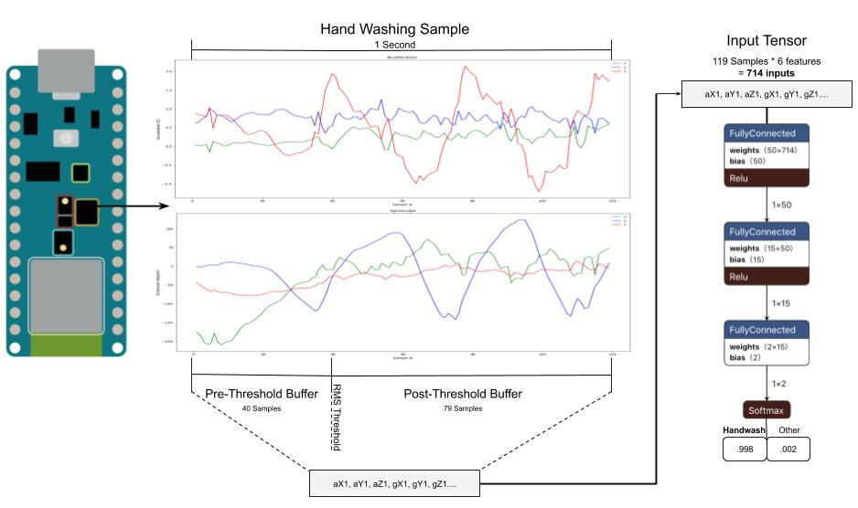

## CS 249r: Gesture Recognition

In this assignment you will explore the tradeoffs in tinyML model design as well as gain familiarity with the gesture recognition application. By the end of this assignment you will understand the connection between model size, layer types, accuracy, latency, and memory consumption. 

## Learning Objectives

*   Gain familiarity with the IMU
*   Understand how to design and customize a tinyML model
*   Experience measuring performance metrics on device

## Relevant Chapters

*   Chapter 11, 12, 15

## Prerequisite(s) 

*   Hello world assignment
*   Visual Studio Code with PlatformIO
*   [Netron graph visualizer](https://lutzroeder.github.io/netron/) (to visualize your models)

## Assignment

The goal of this assignment is to introduce the basic concepts of Neural Network design and modification as well as understanding the inherent tradeoffs in tinyML application design. This assignment is _not_ intended to teach you how to design a unique model architecture from scratch, but rather to demonstrate the process of modifying an existing baseline to fit an application. This is not only a more practical approach for your final projects but more a realistic depiction of ML application design.

The assignment is divided into **3** parts:

*   Testing and understanding the basic application
*   Increasing the scope and scaling up the model
*   Rethinking the model

Throughout all three of these parts, you will be measuring various performance metrics to help illustrate the tradeoffs that are inherent to tinyML.

## Testing and Understanding the Basic Application

First, you will test a simple handwashing detection model to become familiar with the flow of the pipeline. 

The basic application captures data from the accelerator and gyroscope in the Z, Y, and Z Directions. The pipeline will first determine if the Arduino has been moved by calculating the root mean squared (RMS) value on a 0.3 second moving buffer. If at any point the RMS value is above a pre-determined theshold, the pipeline will capture an additional 0.6 seconds before feeding the input directly into a fully connected model.

*   Test the Deployment
    *   Open the PlatformIO project
    *   Unzip the gesture_recognition.zip
    *   Open VS Code
    *   Open the PlatformIO extension
    *   Click ‘Open Project’ button from PIO extension home
    *   Compile the project to check that everything is working properly. (Ignore the warnings)
*   Training the model
    *   Go to this Collab and follow the instructions: [https://colab.research.google.com/drive/12HbUJWrAK50FWmy2Y6QZAiAxPgQUzXh8?usp=sharing](https://colab.research.google.com/drive/12HbUJWrAK50FWmy2Y6QZAiAxPgQUzXh8?usp=sharing)
    *   Press Run Anyway
    *   Make sure to upload the .csv data and take note of how the data is split and organized
    *   Pay special attention to the model being used
    *   Be sure to record
        *   Training accuracy
        *   Validation accuracy
        *   Confusion Matrix
        *   Model size
        *   Header file size
*   Download the model header file (.h) and copy the contents of model array into the g_motion_model array in motion_model.cc in PlatformIO
*   secure the Arduino to your left wrist (using tape, rubber bands, or whatever you have on hand) like this: 

*   Press “PlatformIO: Upload”
*   Once the upload is complete, press “PlatformIO: Serial Monitor”
*   Now try making a handwashing motion like [this](https://drive.google.com/file/d/1MiR2WBDaTLNp7YPNRV2B9XvbVJwZW_GQ/view?usp=sharing)
    *   Note: The accuracy of the deployed model will likely be questionable since all the data was collected on one device. Better data is the best way to improve this application but for the purposes of this assignment, we will stick with what we’ve got.
*   Be sure to record
    *   Invoke time
    *   Memory consumption

## Increasing the Scope and Scaling up the Model

Great we have a hand washing application that puts the [Apple Watch](https://support.apple.com/en-us/HT211206) to shame! Except... our handwashing has a pretty glaring problem: We only detect one of the many motions involved in handwashing. To improve our application we’ll add two more types of handwashing: [back of handwashing](https://drive.google.com/file/d/1MUxdQ7MYAfXT8jp9OmPGSlXNM_YAwvds/view?usp=sharing) and the [*classic* thumb twist hand wash](https://drive.google.com/file/d/1MSbSl-I7o1-LpJeNhDQ7-hALaKns8ydE/view?usp=sharing). (Theses are a bit of a stretch but coming up with distinct handwashing gestures is hard)

*   Go back to the [Collab](https://colab.research.google.com/drive/12HbUJWrAK50FWmy2Y6QZAiAxPgQUzXh8?usp=sharing) and uncomment "back_of_hand_washing" and "thumb_twist_hand_wash" in the GESTURES list.
*   Rerun all of the cells
    *   Record the
        *   Training accuracy
        *   Validation accuracy
        *   Confusion Matrix
    *   Is the model still good enough?
        *   Note: We just made the task quite a bit harder so our very small model doesn’t quite cut it anymore.  \

We are going to try to improve the model but first, let’s get an intuition for how our modifications might impact the performance.

*   Go to [tensorflow playground](https://playground.tensorflow.org/#activation=tanh&batchSize=10&dataset=spiral&regDataset=reg-plane&learningRate=0.03&regularizationRate=0&noise=0&networkShape=4,2&seed=0.43316&showTestData=false&discretize=false&percTrainData=50&x=true&y=true&xTimesY=false&xSquared=false&ySquared=false&cosX=false&sinX=false&cosY=false&sinY=false&collectStats=false&problem=classification&initZero=false&hideText=false) and answer these questions
    *   Try out the spiral input
    *   How does the number of layers impact the classification? How about the number of neurons?
    *   Which input features work best for this data? Why?
    *   How does changing the model impact how quickly it converges?

Now that we have some understanding of the knobs we can tune, let’s improve this model.

*   Go back to the [Collab](https://colab.research.google.com/drive/12HbUJWrAK50FWmy2Y6QZAiAxPgQUzXh8?usp=sharing) and make sure the two additional gestures are uncommented.
*   Try changing the model (# layers, # neurons) and rerun training
*   Experiment with different configurations until you have something that works well
*   Now record
    *   Training accuracy
    *   Validation accuracy
    *   Confusion Matrix
    *   Model size
    *   Header file size
*   Download the NEW tflite file and visualize it in [Netron](https://lutzroeder.github.io/netron/)
    *   Take a screenshot to submit at the end of the assignment
*   Download the NEW model header file (.h) and copy the contents into the g_motion_model array in motion_model.cc.
*   Uncomment the two gestures in the GESTURES array in motion_model.cc.
*   Press “PlatformIO: Upload” and open the Serial monitor
    *   Try all 3 gestures and some other random motions to see how it performs
*   Be sure to record the:
    *   Invoke time
    *   Memory consumption

## Rethinking the model

Scaling up the model only gets us so far when we have a tiny dataset. To get better results we have to look into other types of models. A convolutional neural network (CNN) uses the convolution layer to learn filters that are passed along the input. This generates features which can be passed to fully connected layers for classification.

*   Open this new [Collab](https://colab.research.google.com/drive/1IhCLUuxncphlaKJGbB3BEX8zc-51gO99?usp=sharing)
*   Notice that the data preparation stage and the model have changed
*   Run all the cells and record the:
    *   Training accuracy
    *   Validation accuracy
    *   Confusion Matrix
    *   Model size
    *   Header file size
*   Try adjusting the size and number of the filters in the convolution layers and/or the number and size of the FC layers
*   Once you have a model that with good results, record the:
    *   Training accuracy
    *   Validation accuracy
    *   Confusion Matrix
    *   Model size
    *   Header file size
*   Download the NEW tflite file and visualize it in [Netron](https://lutzroeder.github.io/netron/)
    *   Take a screenshot to submit at the end of the assignment
*   Download the CNN model header file (.h) and copy the contents into the g_motion_model array in motion_model.cc.
    *   Make sure all 4 lines in the GESTURES array are uncommented
*   Switch the main files:
    *   Right-click on “CNN_gesture_recognition.ino.txt” and rename it to “CNN_gesture_recognition.ino”
    *   Rename “FC_gesture_recognition.ino” to “FC_gesture_recognition.ino.txt”
*   Press “PlatformIO: Upload” and open the Serial monitor
    *   Try all 3 gestures and some other random motions to see how it performs
*   Be sure to record the:
    *   Invoke time
    *   Memory consumption

## Submission Details

You will have to submit a short write up with the following:
*   Screenshots of the [Netron](https://lutzroeder.github.io/netron/) visualizations of your two custom models (FC and CNN)
*   Answers to these questions
    *   Which model performed the best?
        *  why?
    *   What are the tradeoffs in model design?
    *   What modifications did you make to the FC model?
        *   How did it change the performance metrics?
    *   What modifications did you make to the CNN model?
        *   How did it change the performance metrics?
*   The metrics you have recorded:
    *   Tiny FC Model (1 handwashing gesture)
        *   Training accuracy
        *   Validation accuracy
        *   Confusion Matrix
        *   Model size
        *   Header file size
        *   Invoke time
        *   Memory consumption
    *   Tiny FC Model (3 handwashing gestures)
        *   Training accuracy
        *   Validation accuracy
        *   Confusion Matrix
    *   Scaled and Customized FC Model
        *   Training accuracy
        *   Validation accuracy
        *   Confusion Matrix
        *   Model size
        *   Header file size
        *   Invoke time
        *   Memory consumption
    *   Original Conv Model
        *   Training accuracy
        *   Validation accuracy
        *   Confusion Matrix
    *   Customized Conv Model
        *   Training accuracy
        *   Validation accuracy
        *   Confusion Matrix
        *   Model size
        *   Header file size
        *   Invoke time
        *   Memory consumption

*  Lingering Questions & Suggestions
   *  Detail any questions you have about the material covered. Also, feel free to make suggestions for how this lab might be improved in the future.
   
   
## Deploying a speech model to the Microcontroller Using the Arduino IDE (in case you are having trouble with VSCode + PlatformIO)
The process is slightly different than before as this project has been exported from PlatformIO.
*  Running an FC model
   *  Unzip the gesture_recognition.zip
   *  Open the gesture_recognition folder
   *  Rename the src folder to FC_gesture_recognition
   *  Open the FC_gesture_recognition.ino file in that folder with the Arduino IDE
   *  Compile and upload and check the output with the Tools->Serial Monitor
*  Running a CNN model
   *  Unzip the gesture_recognition.zip
   *  Open the gesture_recognition folder
   *  Rename the src folder to CNN_gesture_recognition
   *  Open that folder
      * Rename CNN_gesture_recognition.ino.txt to CNN_gesture_recognition.ino
      * Rename FC_gesture_recognition.ino to FC_gesture_recognition.ino.txt
   *  Open the CNN_gesture_recognition.ino file in the Arduino IDE
   *  Compile and upload and check the output with the Tools->Serial Monitor
