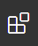
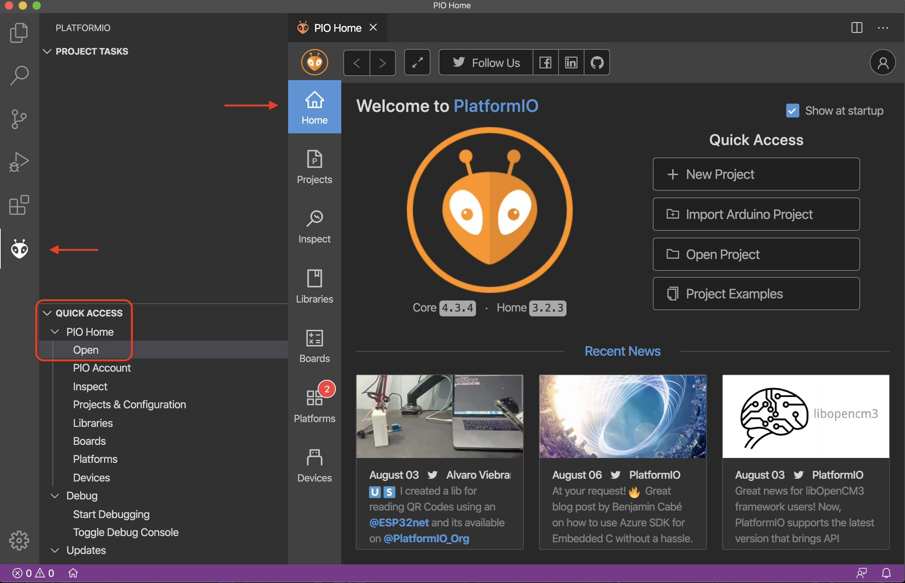
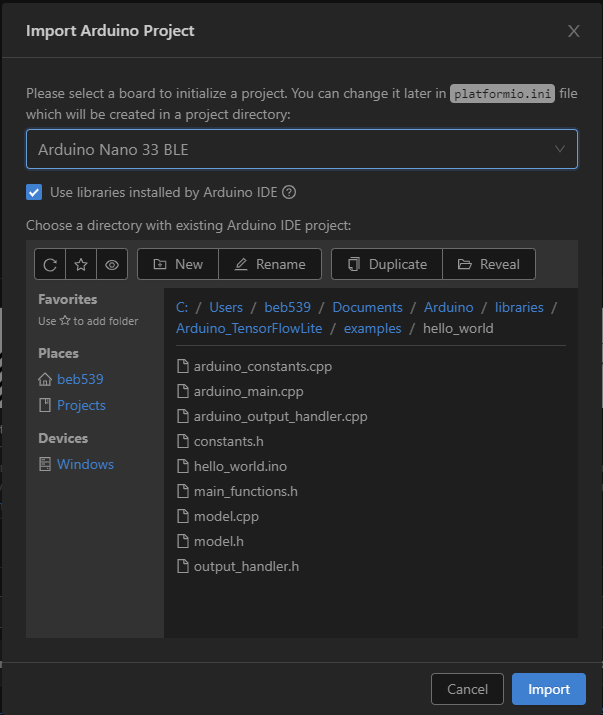
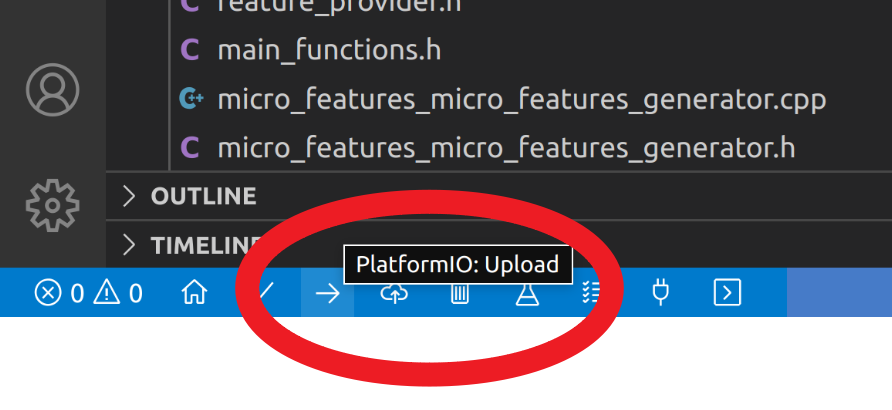
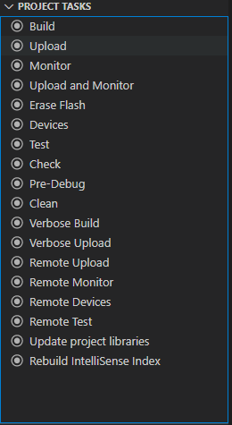
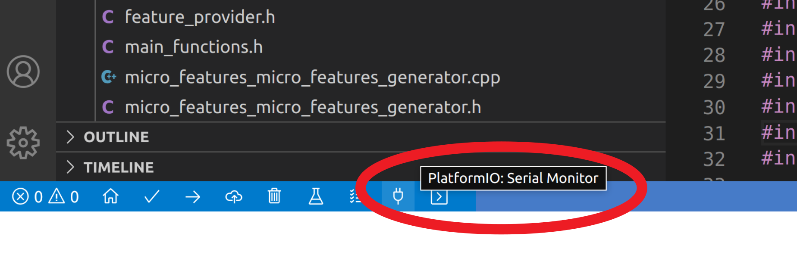

# CS 249r: Hello World


## Learning objectives

* Get familiar with the development environment (VSCode + PlatformIO) that we recommend for use throughout this course
* Deploy your first Tensorflow Lite for Microcontrollers model on your Arduino Nano 33 BLE Sense

## Relevant chapters

* Chapters 4 - 6

## Prerequisites

* Install the latest version  of the [Arduino IDE](https://www.arduino.cc/en/main/software) (> v1.8.13 for compatability) [!]
* Install the latest version of [Visual Studio Code](https://code.visualstudio.com/) 

## Getting setup

The recommended IDE for this course is [PlatformIO](https://platformio.org/), which is an extension of Visual Studio Code (VSCode) intended for development of embedded systems, with intelligent support C/C++ languages. To install it, open VSCode and click on the Extensions tab on the VSCode sidebar on the left-hand side of the window: 

 

Search for ```PlatformIO IDE``` under the Extensions header, select the corresponding result, and click on ```Install``` within the extension description panel that will have appeared on the right-hand side. 

Next, you will need to install the Arduino_TensorFlowLite library, which will enable you to run the ML models you develop in this course on your Arduino Nano 33 BLE Sense. To do so, open the Arduino IDE and click on the ```Tools``` drop down menu, selecting ```Manage Libraries...``` The Library Manager window will appear. Within it, enter ```Arduino_TensorFlowLite``` in the search filter on the top right. Select version ```2.1.0-ALPHA-precompiled``` from the corresponding drop down menu and then install the library. 

Teal text will appear saying ```INSTALLED``` next to the library name to confirm succesful installation. Nice!

## Assignment 

The ```Arduino_TensorFlowLite``` library you just installed carries with it several examples of pre-trained models. To get our feet wet, we'll be uploading the ```hello_world``` example shortly, which is trained to take an input `x` and estimate `sin(x)`. Enthralling, no? While this is admittedly a bit contrived, demonstrative examples of this nature are a good way to wrap your head around what's happening in an approachable application. Chapters 4 through 6 of the TinyML book (which I'm sure you -- yes you -- have already read) discuss this at length. If you haven't had an opportunity to read these chapters in advance, do so now. We don't want to bog this guide down with redudant perspectives or theory, as the purpose of this, and subsequent light-weight guides, is to facilitate practical, hands-on learning. However valuable, the practical guidance we provide here isn't intended to substitute the context and enrichment you have access to in the text and in lectures. Be the best you that you can be and practice diligence in completing readings alongside assignments.  

To keep things simple for now, we're going to deploy a pre-trained model and leave you the option of training your own later. To get started, you need to import the hello world example project from the Arduino library into PlatformIO. Navigate to the PlatformIO Home (which is kind of an odd concept, in that it lives nested within VSCode) by either selecting the ```Home``` icon on the top right of the PlatformIO sidebar within VSCode or, if the last option did not match what's in front of you, click on the PlatformIO icon on the VSCode sidebar, revealing a ```Quick Access``` panel on the bottom left wherein you can select PIO Home -> Open. 

 

The ```Quick Access``` buttons on the PlatformIO home allow will allow you to call on the library of interest or other arduino projects, by clicking on ```Import Arduino Project```. In the pop-up window that appears, search / select the ```Arduino Nano 33 BLE``` from the board selection drop down menu, **check the ```Use libraries installed by Arduino IDE``` box** and navigate to the default Arduino directory, which is typically within a Home or Documents folder, but could vary if you elected to configure the Arduino install differently. From there, navigate down to ```libraries/Arduino_TensorFlowLite/examples/hello_world```. 

Altogether, your ```Import Arduino Project``` pop-up window should look like this:



If it does, click ```Import```. Nice!

Importing an existing project in this way will create a PlatformIO project within its IDE workspace with the nomenclature YYMMDD-HHMMSS-nano33ble, capturing the timestamp for import.  If you'd like to rename your manifestation of the project something more intuitive, you can right click on the ```platformio.ini``` configuration file from within the project and select ```Reveal in Finder / File Explorer```. Once your file manager opens, close VSCode, and rename the folder as you would any other folder. Upen reopening VSCode, right click on the old project name and select ```Remove Folder from Workspace```. Finally, go to ```File -> Add Folder to Workspace``` and select the renamed folder. 

Plug in your Arduino Nano 33 BLE Sense board at this point, if you haven't already, and PlatformIO should recognize it automatically. 

You can build or compile the sketch (jargon used to describe an Arduino program) by clicking the PlatformIO build button which is denoted by a check mark in the PlatformIO ribbon on the bottom left of the VSCode Window. You can also open the ```Project Tasks``` menu by clicking the the PlatformIO icon on the sidebar, then click ```Build```. 

Similarly, you can upload the sketch to the device by clicking the PlatformIO upload button which is denoted by a right-facing arrow in the PlatformIO ribbon in the bottom left of the VSCode Window. You can also open the ```Project Tasks``` menu by clicking the the PlatformIO icon on the sidebar, then click ```Upload```. Note that in uploading the sketch, you will compile the code, either from scratch or incorporating any changes you've made since your last compilation. 

Upload icon in ribbon:



PlatformIO sidebar icon:


Project tasks menu:



You will likely see a number of warnings related to the TensorFlow library as it is compiling. These are normal and nothing to worry about. If you see any ```fatal error```s, however, check the Troubleshooting section below. When the upload finishes you should see the message ```Done in xx seconds``` in the PlatformIO terminal, which details all sorts of activity, especially during compilation and upload.  

If everything was successful, the yellow LED next to the microUSB port on the Nano board should begin pulsating sinusoidally, saying hello to the world, as it were. You can also check the current brightness setting of the LED by opening the ```Serial Monitor```, either by clicking the electrical plug icon in the VSCode ribbon (pictured below), or by clicking ```Monitor``` in the ```Project Tasks``` menu, described above. 



Congratulations, you've just deployed your first TinyML model! 

Wow, that wasn't so bad, was it?

### Optional Extension

If you're interested in taking a closer look at how this model was trained, converted to a TFLite model, and quantized for deployment on a microcontroller, check out this [GitRepo](https://github.com/tensorflow/tensorflow/tree/master/tensorflow/lite/micro/examples/hello_world/train). To take things a step further and to prepare for future assignments, you can open the iPython notebook in that repository via Google Colab and run through the training yourself.

If you chose to train your own model in the Colab (which is entirely optional), here are somethings to know:

You will need to download the resulting ```models/model.cc``` file from Colab and copy the binary data in that file that encodes the model (which looks something like this: 0x1c, 0x00...) into the ```model.cpp``` file in your PlatformIO project. You also need to copy the model length ```g_model_len``` into the ```model.cpp``` file. Note that these files are not identical and you should only copying the relevant data (the binary data and model length), not other elements, like variable declarations, et cetera. 

## Troubleshooting

We hope this process has been agreeable, but if you're running into issues, we've compiled a list of common issues with suggested solutions here. Because this is the first hands-on experience, some of these issues are fairly generic and may apply to later assignments. As a final note: if you find an issue that isn't addressed here, please let us know so that we can not only better support you, but also your peers and future students. 

* I'm seeing compliation issues related to the ```Arduino_TensorFlowLite``` library.
    * Most likely you've forgotton to check the ```Use libraries installed by Arduino IDE``` checkbox during project import (don't worry we can fix that now). Alternatively, the ```platformio.ini``` file may have the wrong value for the Arduino library path ```YOUR_ARDUINO_FOLDER_PATH``` in the line:  ```lib_extra_dirs = YOUR_ARDUINO_FOLDER_PATH/libraries```. PlatformIO assumes it is located at ```Documents/Arduino``` so if yours is located in another place you'll need to update this line. If you didn't click the checkbox that line will be missing. In either case simply add/update that line to the correct value and you should be good to go!

* I've uploaded code previously, but now my Arduino Nano 33 BLE Sense isn't responding or appearing on any ports.
    * You can perform a [double tap reset](https://forum.arduino.cc/index.php?topic=648781.0) to step into the bootloader and replace the runaway code.

* I'm running ```Ubuntu 18.04``` and I can't seem to access the serial port to upload my code.
    * You may need to add yourself to the ```dialout``` user group to get access to the serial port. To do that run ```sudo usermod -aG dialout <USER_NAME>``` and then logout and then log back in. Now your user should have the correct permissions.
    * You may also need to correctly ```chmod``` the serial port. E.g., ```sudo chmod a+rw /dev/ttyACM0```.
    * You may have the ```modemmanager``` package installed and set to auto-capture all serial devices. This package is used for cellular connections from your laptop. If you are not using your laptop for cellular you can remove the package with ```sudo apt-get purge modemmanager```.
      
