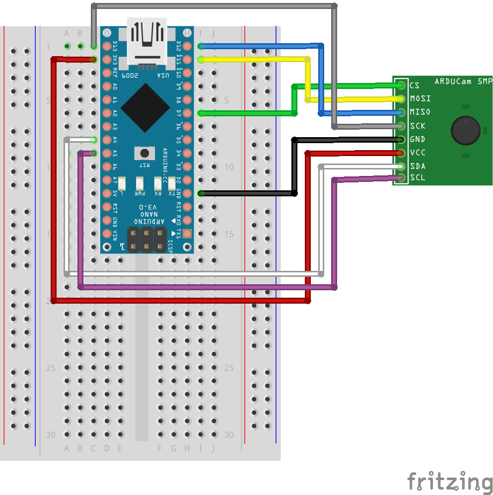

# CS 249r, Computer Vision on Microcontrollers
In this assignment, you will learn how to build real-time computer vision applications on a tiny microcontroller. By the end of the assignment, you should have learnt the basic computer vision application, tools, dataset preparation, model training, using transfer learning, and deploying it on a tiny microcontroller. Also, enabling computer vision application on a resource constrained device (e.g., a microcontroller) is a hot research topic. Doing this assignment would expose you to the various challenges in the domain. 

## Learning Objectives
* How to interface ArduCam to an Arduino Nano 33 BLE.
* How to train a neural network model to detect a person.
* How to use a pre-trained person detection model and use transfer learning to detect if a person is wearing a mask or not. Transfer learning is particularly useful when you have a few data samples or don't have enough training resources.

## Relevant Chapters

* Chapters 9, 10

## Prerequisite(s) 
* Hello world assignment
* Using Arduino IDE/VSCode+PlatformIO to flash binaries to the Nano 33 BLE

   * For Arduino IDE, use these instructions in [assignment-1](../wake_words/README.md#deploying-a-speech-model-to-the-microcontroller-using-vscode--platformio).
   * For VSCode+PlatformIO, use these instructions provided in [assignment-1](../wake_words/README.md#deploying-a-speech-model-to-the-microcontroller-using-vscode--platformio).
   
* Arduino_TensorFlowLite libraries already installed and configured
* Breadboard and connectors (You should have received it as part of the startup kit)
* Setup environment/TensorFlow/TF-Slim (if you want to run this on your local machine)

   [Setup Guide](Setup.md)
   
* Google Colab
   
   * [Getting started with Colab](http://bit.ly/CS249-F20-IntroToColab)
   
   * You can follow the same instructions below and use colab for finishing all the modules.
   
   * **For this assignment, we have created a [colab template](https://bit.ly/30MEs0f). We show you how to check out the repository and run training (as examples). Unlike the last assignment, you need to fill the cells with code/commands yourself for the rest of the modules.**
   * If you run the cells in the [colab template](https://bit.ly/30MEs0f), it will prompt a warning message saying it was not authored by google. So create a copy of the colab in your drive and use that instead.
   
* [Windows Batch Script](http://steve-jansen.github.io/guides/windows-batch-scripting/)/[Linux Shell Script](https://linuxconfig.org/bash-scripting-tutorial-for-beginners)
  * If you decide to run this assignment on Windows 10 machine, you will use ```*.bat``` (batch files).
  * If you decide to run this assignment on Unix machine (Mac OSX/Ubuntu), you will ```*.sh``` (bash files).
  * If you decide to run this on Google Colab, you can directly run python script or use ```*.sh``` in the cells.
  * In ```*.bat``` files, for line breaks you will use ```^```. In ```*.sh``` files, for line breaks you will use ```\```. Please pay attention to this when you run the command.The instruction below tends to use ```\``` for line breaks. But if you use ```*.bat```, you will need to use this ```^``` instead. 
  
* [Netron graph visualization tool](https://github.com/lutzroeder/netron)
  * You will use this tool for determining the node names for transfer learning part of the assignment.

## Submission Details
Your efforts will determine the final accuracy for module-3 so that will carry more weight compared to module-1 and module-2. If you follow the instructions carefully, you should complete module-1 and module-2 without much difficulty. But we still want you to show us that you finished the first two modules successfully. Your submission will include the following:

1. A video demonstration of module-1, module-2, and module-3. Each can be 15-30 seconds long. 
2. For module-3, did your model learn to detect if you are wearing a mask or not? What did you do to make it work?  
3. Submit a short write-up summarizing the key steps you took to finish module-3 successfully. For example, you can touch upon some of the items below:

   * How did you curate the dataset?
   * How many images per class did you collect? Did increasing or decreasing the number of images per class help increasing the accuracy or deployment accuracy?
   * What do you think about the quality of the dataset you collected? Do you think it caused any issue with accuracy or false-positive/false-negatives during          deployment?
   * Did you find any corner cases in your dataset that cause an issue with accuracy? What did you do to mitigate it? Did fixing those help in your final accuracy?
   * Did you experiment with the number of layers you added to the "exclude scope"? Did that help?
   * Did you find any way to fool the model (false-positives)? What do you think was the cause? What improvements do you think can be made to fix this issue?
   * Finally, what issues do you see in deploying this solution for enforcing COVID-19 mask guidelines in different places?
   
4. In case you did not get it to work, still, tell us what you did. You can use the same questions listed above to summarize what you did.

5. Please submit the final model.cc file.


## Assignment 

The assignment's goal is to expose you to all the tools and methodology to build a computer vision application powered by a tiny microcontroller. The assignment is divided into three sub-modules, and we briefly define the objectives below:

* **Module-1**: In this module, you will deploy the pre-trained person detection model to Arduino Nano 33 BLE. By doing so, you will validate that the camera interface to the Arduino Nano 33 BLE is correct. You will also be exposed to serial monitor tools, which you can use to debug or monitor the program status.

* **Module-2**: In this module, you will train a neural network model to detect a person. Unlike assignment 1, training neural network models for vision task is computationally expensive. We would give you a pre-trained checkpoint for the person detection model using the coco dataset to focus on the learning objectives. Using the checkpoint will you will restore the model and continue to train. While doing so, you will be exposed to Tensorboard and monitor the training progress. If you have access to a GPU machine, you can opt for training from scratch without the checkpoint.

* **Module-3**: In this module, you will use transfer learning to detect if the person is wearing a mask of not. Transfer learning is particularly useful when you have a limited training dataset or don't want to train from scratch. 


## Getting started


### Module-1: Testing out the ArduCam interfacing with Arduino nano 33 BLE
In this module, you will interface the ArduCam with Arduino Nano 33 BLE and run an off-the-shelf person detection model. 

**Camera Interfacing With Arduino**

This is the first assignment where you rely on an external sensor to interface to the Arduino Nano 33 BLE. For interfacing the Arducam and the microcontroller, you will use the breadboard and use the connectors to interface them. Please refer the tinyML book chapter 9 for the pin connection from the ArduCam to the Arduino Nano 33 BLE or as shown below


Now, you need to install the camera drivers for ArduCam. The camera driver is a firmware (software) that will allow exposing certain functionality of the hardware (camera) to a higher level software stack (in this case, its the TensorFlow Lite Micro). For example, to detect a person, the camera's image has to be read from the sensor buffer (residing in the ArduCam) and copied to the memory in the microcontroller. The camera's output is a JPEG, and to pass the image to the neural network model (remember the input to the neural network model is an image), there are extra processing steps. First, the JPEG image needs to be decoded to raw pixel values, which the neural network model expects.  Once the raw pixel values are decoded, additional preprocessing steps are performed such as converting to cropping and converting it to grayscale to output (In this case, to say if a person exists or not denoted by the LED color)

Luckily, we don't have to write the camera driver or the JPEG decoder ourselves, and it is provided by the camera vendor/other developers. To download the camera driver and the JPEGDecode library, follow the steps below:

1. Download the [Arducam library](https://github.com/ArduCAM/Arduino) to interface the camera with the Arduino. Extract the Zip file, add the camera driver and choose the right configuration for Arducam 5MP Plus:<br>

    ```Sketch -> Include Library -> Add .Zip Library -> <Path to the extracted Zip file> ``` <br>

    ``` open Arduino/libraries/ArduCAM/memorysaver.h ``` <br>
    ```
    //#define OV2640_MINI_2MP
    //#define OV3640_MINI_3MP
    //#define OV5642_MINI_5MP
    //#define OV5642_MINI_5MP_BIT_ROTATION_FIXED
    //#define OV2640_MINI_2MP_PLUS
    #define OV5642_MINI_5MP_PLUS
    //#define OV5640_MINI_5MP_PLUS 
    ```


2. Install the JPEGDecoder library from the Arduino IDE. <br>
    ``` Tools -> Manage Libraries -> search for "JPEGDecoder" ``` <br>
    After installing, go to ``` open /Arduino/libraries/JPEGDecoder/src/User_Config.h ``` and make sure to comment
   
   ```#define LOAD_SD_LIBRARY``` 
   
   ```#define LOAD_SDFAT_LIBRARY```

    After interfacing the camera, microcontroller, and installing the drivers, it is time to test if everything works. First, connect the micro-USB to the Arduino Nano 33 BLE to power-on the microcontroller (it should automatically power-on when you plug the micro-USB). By default, it will load the program that was flashed before (hello world or Assignment 1 or whatever you tried before).

3. The default person detection example works only for ArduCam 2MP camera. In this course, you will use 5MP version. To get the source files for ArduCam 5MP camera, please clone this [github repository](https://github.com/srivatsankrishnan/cs249-assignment2). Copy the "hw_deployment/person_detection_arducam_5MP_plus" to your Arduino Example folders: <br>

``` $ git clone https://github.com/srivatsankrishnan/cs249-assignment2 ```

From now on, we will call the directory where you have cloned as `"<ROOT>"`.

In Mac OSx (where ever you have installed Arduino libraries):
 
 ``` 
     cp -r <ROOT>/hw_deployment/person_detection_arducam_5MP_plus/  \
     /Users/<YOUR_USERNAME>/Documents/Arduino/libraries/Arduino_TensorFlowLite/examples/ 
 ```

In Windows 10:

```
   Xcopy /E <ROOT>\hw_deployment\person_detection_arducam_5MP_plus\ C:\<YOUR_USERNAME>\Documents\Arduino\libraries\Arduino_TensorFlowLite\examples
```


4. Compile the person_detection source files and upload the binary to the Arduino nano sense BLE. Before proceeding, please make sure the board and ports are configured correctly:<br>
    ``` Tools -> Board -> Arduino Nano 33 BLE ```
    ``` Tools -> Port -> COMx (Nano 33 BLE) ``` where COMx will depend upon your computer operating system. For Ubuntu, it is TTYxx. For OSx, it will be /dev/cu.usbmodem142xx(Arduino Nano 33 BLE)

5. Click the ``` Upload ``` button. 

6. Test that the application is working. Point your camera to anything that is not a person. At this point, the red led light should flash. Next, point the camera to any person, and the green LED should flash. To make sure the camera is capturing the image, look for the blue LED flash. It is important to note that the inference latency is 19 seconds. So it can stay red or green for that long even if you point the camera somewhere else. So please be patient!

7. In case if you don't notice either red/green/blue LED activity, then open the Serial monitor the log messages. <br>

    ``` Tools -> Serial Monitor ```

    In case if there are any issues with the camera interface, look for error messages such as:

    ```
    03:46:19.484 -> ReadData failed
    03:46:19.484 -> Image capture failed.
    ```
    The above error means the camera is not able to communicate with the Arduino nano BLE 33. Please make sure the wiring is correct and intact.<br>

    In the case where it works correctly, you should see the log message such as:

    ``` 
    03:42:53.421 -> Person score: 142 No person score: 194
    03:42:53.421 -> Starting capture
    03:42:53.456 -> Image captured
    03:42:53.523 -> Reading 3080 bytes from Arducam
    03:42:53.595 -> Finished reading
    03:42:53.595 -> Decoding JPEG and converting to greyscale
    03:42:53.702 -> Image decoded and processed
    ```

    If you got this working, you have interfaced the camera with the microcontroller and successfully ported a pre-trained computer vision application. In the case you could not get it to work the first time, please take a look at the step by step [video](https://www.youtube.com/watch?v=6VXdwxviTG4). In the next module, we will learn how to train our own person detection models from scratch.

### Module-2: Training your own person detection model
In this module, you will train your own model from a previously saved checkpoint. You will start from a previous checkpoint because training neural network models for vision tasks can take really long. We provide pre-trained checkpoints for the person detection to resume the training from where we left (~750k-850k steps). If you have a dedicated machine with a powerful GPU to train, you can choose to train from scratch. Depending upon your training machine configuration, training time might vary. On a machine with Nvidia V100 or RTX2080, it can take up to three days to train a model from scratch.  This module's goal is to get acquainted with training a neural network model for computer vision tasks using TensorFlow. 

To get you started with the module-2, you will use the same [repository](https://github.com/srivatsankrishnan/cs249-assignment2)


**Creating Dataset for your Training**

First, download the coco dataset so you can use it to create custom categories (e.g., person) from it.

``` $ cd <ROOT>\cs249-assignment2\ ```

``` 
$ python download_and_convert_data.py \
            --dataset_name=visualwakewords \
            --dataset_dir=data\visualwakewords
```
This should download the coco dataset at ``` <ROOT>\data\visualwakewords``` location. Please note that depending upon your connection speed, it will take some time to download the dataset (~40 GB). Also, this is one time process.

Once the download is complete, the above script will also extract the images and convert them to TFRecord, which will then be used to train the model.

**Training the Model from Previous Checkpoint**

For restoring the model to train from a previous checkpoint, we will use the ```train_vww.bat```. This is the main training script to pass the neural network model (e.g., MobileNet_V1), training data, hyperparameters, etc. It is highly advisable not to change the hyperparameters for this assignment. For this assignment's purpose, the two parameters that you will change in this script are ```--train_dir``` and ```--dataset_dir```. The ```train_dir``` is the directory where you want to save the intermediate checkpoints, tensorboard event files, and final trained model. The ```--dataset_dir``` is the directory where you have the dataset. If you followed the previous step, you should pass in the ```<ROOT>\data\visualwakewords```. If your machine has GPU and correctly installed TensorFlow for GPU, you can change the ```--clone_on_cpu``` flag to `False`. By default, we assume your machine doesn't have GPU, and it will train on the CPU. If you are running on the colab, you will set this flag to  `False` after you choose the GPU runtime.

1. cd into the directory where training scripts are placed.
    
``` $ cd <ROOT>\cs249-assignment2\ ```

2. For the person detection model, you can find a pre-trained checkpoint in `cs249-assignment2\ckpt\`. In some cases, we saw the checkpoint path was not getting picked up. So the foolproof way to make sure your training starts from the checkpoint is to copy all the files in `<ROOT>cs249-assignment2\ckpt\` to your ```--train_dir. ```

```
     python train_image_classifier.py \
    --train_dir=<XXXXXXXX> \
    --dataset_name=visualwakewords \
    --dataset_split_name=train \
    --dataset_dir=<ROOT>\data\visualwakewords \
    --model_name=mobilenet_v1_025 \
    --preprocessing_name=mobilenet_v1 \
    --train_image_size=96 \
    --use_grayscale=True \
    --save_summaries_secs=300 \
    --learning_rate=0.045 \
    --label_smoothing=0.1 \
    --learning_rate_decay_factor=0.98 \
    --num_epochs_per_decay=2.5 \
    --moving_average_decay=0.9999 \
    --batch_size=96 \
    --max_number_of_steps=1000000 \
    --clone_on_cpu=True
 ```  

 3. Train the Model (Windows 10)

``` $ train_vww.bat``` 

For Unix (Mac OSX/Ubuntu)

``` $ train_vww.sh```
 
This should start the training script and start the training from a previously saved checkpoint.

This completes the training from a previously saved checkpoint. In case you got stuck or having issues so far, check out the step-by-step [video](https://youtu.be/gqs5kYjaV40). This video shows the process on Windows 10, but the process should stay the same for other OS too.

**Training the Model from Scratch**

After you have created the dataset, you should be able to train the model from scratch by following the steps below:

1. cd into the directory where training scripts are placed.
    
``` $ cd <ROOT>\cs249-assignment2\ ```

2. Make changes to the training scripts to point to the dataset directory, directory to save checkpoints, etc. Open the ```train_vww.bat``` (or ```train_vww.sh```) file in an editor

This is the main training script to pass the neural network model, training data, hyperparameters, etc. It is highly advisable not to change the hyperparameters for this assignment. For this assignment's purpose, the two parameters that you will change are ```--train_dir``` and ```--dataset_dir```. The ```train_dir``` is the directory where you want to save the intermediate checkpoints, tensorboard event files, and final trained model. The ```--dataset_dir``` is the directory where you have the dataset. If you followed the previous step, you should pass in the ```<ROOT>\data\visualwakewords```. If your machine has GPU and correctly installed TensorFlow for GPU, you can change the ```--clone_on_cpu``` flag to `False`. By default, we assume your machine doesn't have GPU, and it will train on the CPU.

```
     python train_image_classifier.py \
    --train_dir=<XXXXXXXX> \
    --dataset_name=visualwakewords \
    --dataset_split_name=train \
    --dataset_dir=<ROOT>\data\visualwakewords \
    --model_name=mobilenet_v1_025 \
    --preprocessing_name=mobilenet_v1 \
    --train_image_size=96 \
    --use_grayscale=True \
    --save_summaries_secs=300 \
    --learning_rate=0.045 \
    --label_smoothing=0.1 \
    --learning_rate_decay_factor=0.98 \
    --num_epochs_per_decay=2.5 \
    --moving_average_decay=0.9999 \
    --batch_size=96 \
    --max_number_of_steps=1000000 \
    --clone_on_cpu=True
 ```    
3. Train the Model

Windows 10:

``` $ train_vww.bat```

Ubuntu/Mac OSx:

``` $ train_vww.sh```

4. To visualize the progress in Tensorboard, please open another terminal and invoke the following command:
``` $ tensorboard --logdir= <train_dir_path>```

You will pass the ```--train_dir``` path that you used in the `2` step. It is basically the path where you have your training progress, such as TFEvent files, checkpoints, etc. 

This completes the training from the scratch module. In case you got stuck or having issues so far, check out the step-by-step [video](https://youtu.be/6_BoM5_tFXk).

**Testing the Model performance on Validation Set**

Once you have trained the model, you will have to test the model with previously unseen data. This is where the validation data comes handy. If the model performs well on the validation set, you should have sufficient confidence that your model did not overfit the training data. To evaluate the model on unseen data, follow the instruction below:

1. cd into the directory where training scripts are placed.
    
``` $ cd <ROOT>\cs249-assignment2\ ```

2. Make changes to the training scripts to point to the dataset directory, directory to save checkpoints, etc. Open the ```eval_vww.bat``` file in an editor.

This is the main evaluation script where you would pass the trained neural network model, validation data, etc. For evaluating the trained model, you will change two parameters-- ```--checkpoint_path``` and ```--dataset_dir```. The ```checkpoint_path``` is the directory where the training script saves the checkpoints, tensorboard event files, and final trained model. The ```--dataset_dir``` is the directory where you have the validation dataset. If you followed the previous step, you should pass in the ```<ROOT>\data\visualwakewords```

 ```
     python eval_image_classifier.py \
    --alsologtostderr \
    --checkpoint_path=<XXXXXXX> \
    --dataset_dir=<ROOT>\data\visualwakewords \
    --dataset_name=visualwakewords \
    --dataset_split_name=val \
    --model_name=mobilenet_v1_025 \
    --preprocessing_name=mobilenet_v1 \
    --use_grayscale=True \
    --train_image_size=96
```

If everything works correctly, you will expect output similar to the log below:
```
INFO:tensorflow:Evaluation [40/406]
I0804 23:38:43.341851  5052 evaluation.py:167] Evaluation [40/406]
INFO:tensorflow:Evaluation [80/406]
I0804 23:38:49.969852  5052 evaluation.py:167] Evaluation [80/406]
INFO:tensorflow:Evaluation [120/406]
I0804 23:38:56.645852  5052 evaluation.py:167] Evaluation [120/406]
INFO:tensorflow:Evaluation [160/406]
I0804 23:39:04.014127  5052 evaluation.py:167] Evaluation [160/406]
INFO:tensorflow:Evaluation [200/406]
I0804 23:39:10.628128  5052 evaluation.py:167] Evaluation [200/406]
INFO:tensorflow:Evaluation [240/406]
I0804 23:39:17.246128  5052 evaluation.py:167] Evaluation [240/406]
INFO:tensorflow:Evaluation [280/406]
I0804 23:39:23.852129  5052 evaluation.py:167] Evaluation [280/406]
INFO:tensorflow:Evaluation [320/406]
I0804 23:39:30.446127  5052 evaluation.py:167] Evaluation [320/406]
INFO:tensorflow:Evaluation [360/406]
I0804 23:39:37.041127  5052 evaluation.py:167] Evaluation [360/406]
INFO:tensorflow:Evaluation [400/406]
I0804 23:39:43.623127  5052 evaluation.py:167] Evaluation [400/406]
INFO:tensorflow:Evaluation [406/406]
I0804 23:39:44.610126  5052 evaluation.py:167] Evaluation [406/406]
eval/Accuracy[0.759852231]
eval/Recall_5[1]
```
This completes the model evaluation post-training. In case you got stuck or having issues so far, check out the step-by-step [video](https://youtu.be/B31zkRpF5tE).


**Export Graph, Freeze Model, and Quantization**

Once you have trained your model (either from scratch or from a checkpoint), the next step is to prepare the model's conversion to a c source file so that you can load than on the Arduino Nano 33 BLE. To do that, follow the steps below:

1. cd into the directory where training scripts are placed.
    
  ``` $ cd <ROOT>\cs249-assignment2\ ```

2. Export the model graph by running the ```export_graph_def.bat``` (or ```export_graph.sh```) command. This command will create the graph definition for the neural network model that you used (MobileNetV1). Unless you change the name of 
the ```---output_file```, the name of the graph def will be ```vww_96_grayscale_graph```.

Windows 10:

  ```$ export_graph_def.bat```

Ubuntu/Mac OSX:

  ```$ export_graph_def.sh```


3. Before freezing the graph, edit the ```freeze_weights.bat``` (or ```freeze_weights.sh```) script. This command will store the weights values as constants in the corresponding node in the graph def. Also in this step, the script will prune the nodes that are not needed in the forward inference (e.g., nodes that are needed for gradient computation in backpropagation are all pruned from the graph). The parameters in the script are explained below:

  ```
  python freeze_graph.py \
      --input_graph=vww_96_grayscale_graph.pb \
      --input_checkpoint="C:\workspace\cs249-assignment2\vww_96_grayscale\model.ckpt-463859" \
      --input_binary=true \
      --output_graph=person_detection_frozen.pb \
      --output_node_names=MobilenetV1/Predictions/Reshape_1
  ```
  
  ```--input_graph``` is the name of the graph def file that you saved after step 2.
  ```--input_checkpoint``` is the model name of your final trained model
  ```--output_graph``` is the name of the frozen graph. If you don't change the parameter, by default, it will be saved as ```person_detection_frozen.pb```
  ```--output_node``` is the name of the last node in your neural network model. For this assignment, you will use MobileNetv1, so the node name will be             ```MobilenetV1/Predictions/Reshape_1```

After you changed the input values, run the ```freeze_weights.bat``` (or ```freeze_weights.sh```) script.

4. run the freeze weights script

Windows 10:

  ```$ freeze_weights.bat```

Ubuntu/Mac OSx

  ```$ freeze_weights.sh```


5. Once you have frozen the weights along with the graph (step 3 and step 4), the next step is to quantize the weights in int8 format. Run the ```quantize_weights.py``` script. For effective quantization, you need to provide a representative input sample so the quantization script can monitor the range, which it will use it during quantization. Use the ```--sample_data``` flag to point to a representative input dataset. The second input (```--frozen_model```) to the quantization script is the frozen model that you created in Step 4. By default, the output will be the TensorFlow Lite file (TFLite) called ```person_detection.tflite```. 

  ``` $ python quantize_weights.py --sample_data <Path to the sample data> --frozen_model <path to the frozen model>```

6. Once you have generated the TFLite file, you will convert the TFLite file to a c++ source file to deploy it on the Arduino Nano 33 BLE. You can use ```xxd.exe``` available in [git-bash](https://git-scm.com/downloads) for Windows 10. For Ubuntu, you can install it with ```sudo apt-get install -y xxd```. For Mac OSx, ```xxd``` was already installed by default. The command to generate the c++ source file from the TFLite file is shown below:

Windows 10 (on git-bash)
  ``` $ xxd.exe -i <path to tflite file> > <name of the c++ source file>```

Ubuntu/Mac OSx:

  ``` $ xxd -i <path to tflite file> > <name of the c++ source file>```

This should convert the TFLite file of your trained model into a C++ source file that you can readily deploy in the microcontroller. This completes the exporting, freezing, and quantizing the trained model to TFLite, followed by converting it to C++ binary file. In case you have an issue getting this far, watch the step-by-step instruction [video](https://youtu.be/yHf_XWGzRxI)


**Deploying on Arduino Nano 33 BLE**

For deploying your trained model (using the above instruction), you need to make sure you install Arduino TensorFlowLite 2.1.0-ALPHA. You will use the [Arduino project](https://github.com/srivatsankrishnan/cs249-assignment2/tree/master/hw_deployment/person_detection_arducam_5mp_plus) project as the basic template on which you will load your model data. Navigate to the the `person_detect_model_data.cpp` file to copy your c++ binary data to store it in the variable `alignas(8) const unsigned char g_person_detect_model_data[]`.

Next navigate to the [`person_detection_arducam_5mp.ino`](https://github.com/srivatsankrishnan/cs249-assignment2/blob/master/hw_deployment/person_detection_arducam_5mp_plus/person_detection_arducam_5mp_plus.ino) file to change the `kTensorArenaSize` parameter. By default, the value is `136 * 1024 `. For determining the required size for your trained model, please use the utility designed by [Edge-Impulse](https://github.com/edgeimpulse/tflite-find-arena-size). Using the correct `kTensorArenaSize` is important since too small or too large, it will fail to initialize TFLite. Once you made these two important changes, you can compile and project and flash the binary to load onto the Arduino Nano 33 BLE using Arduino IDE/Platform I/O.

This completes the deploying of the model you trained from scratch to the microcontroller. In case you had issues getting this part working, watch this step-by-step instruction [video](https://youtu.be/a55Ht4sLV3E).

### Model-3 Transfer Learning
In this module, you will learn how to use transfer learning to use a pre-trained model and use the learned features in the pre-trained model to detect new objects. For instance, in module 1 and module 2, you have trained a person detection model. Can the model's ability to detect a person be extended to detect if a person if wearing a mask or not? Often learning a new task would require a representative dataset and lots of computational resources. Transfer learning is particularly helpful if you are in short of training data and computational resources. With transfer learning, you can build an effective model very quickly with very few data samples.  An alternate approach to achieve the same functionality (to detect if a person is wearing a mask or not), you could train a model from scratch like module 2, but the drawback is you need lots of training data and computational resources.

**Download Dataset**

First and foremost, to extend the person detection model's functionality to detect mask, you will need datasets for two classes: "no-mask person" and "mask person". There are multiple ways to source your dataset. You can use Google Images, Flickr, or other photo hosting services. In this assignment, you will use a [flickr scraper tool](https://github.com/ultralytics/flickr_scraper). Please note that when you download images from photo hosting sites, please be honor the privacy and license agreements terms of the hosting service. For Flickr, they would need to create an account and obtain the user access keys to scrape the images from their service. 

1.  To apply for a Flickr account, go to this ["Create Flickr Account"](https://www.flickr.com/services/apps/create/apply)

2. Once you create an account and verify your registration email, you will be taken to the `The App Garden` page, where you will be asked to apply for the key. For this class, you will select `Apply for a Non-Commercial Key` option.

3. Upon completing Step.2, you will be asked to describe what you are planning to do with the scraped images. Please fill in the form with a name, and for description, please enter this: `For educational purposes only. Images downloaded from Flickr will be used to build a machine learning model to detect if a person is wearing a mask or not. We do not plan to use these for commercial purposes.`

4. Once you get the access key and secret passcode, you will use that in `flickr_scraper.py` line 10-11 downloaded from the [flickr scraper tool](https://github.com/ultralytics/flickr_scraper):
   
   ```key =   # Flickr API key https://www.flickr.com/services/apps/create/apply```
   
   ```secret =  # Flickr API key https://www.flickr.com/services/apps/create/apply```

5. To download the images, please run the following code you checked out from this  [flickr scraper tool](https://github.com/ultralytics/flickr_scraper):

    ``` $ python flickr_scraper.py --search <Keyword> --n <Number of Images> --download```
    
    where,

    `<Keyword>` is the search query you would use to download the images (e.g., airplane, car, trains, etc.)
    `<Number of Images>` is the total number of images you want to download to form your dataset (e.g., It can be in the range of 100-500).

    The process of collecting/curating your dataset is a very important step. If your model does not get representative data, then its learning will be poor. So in the spirit of learning, we will leave it up to you to choose what keywords you use to curate your dataset and how many images you want in it. (Tip 1: Few 100s of images should be good enough!). (Tip 2: You can search for the images on [Flickr](https://www.flickr.com/) to see if you are getting representative images for your search query. By that you can zero in on the `<keyword>`. Please also eye-ball the downloaded images to make sure they are representative.)

    Also, you need to make sure for each category, there is a separate folder. For example, if you are downloading images with a person wearing a mask, you will save it all in the `absent mask` (you can choose whatever name you want!) folder. Likewise, if you download images with a person wearing a mask, you will save it `mask` folder. Once you have images for each category in their respective folders, keep the root folder as `TL_Datasets` (the conversion script expects this name!). Your folder tree should resemble something like this:

  ```
      │   TL_Datasets
      │       ├───absent_mask
      │       └───mask
  ```

**Dataset Preparation**

Once you have downloaded the dataset and a folder structure as described above, edit the `convert_jpg_tfrecords.bat` (or `convert_jpg_tfrecords.sh`) file:

  ```
  python datasets\download_and_convert_data.py \
      --dataset_name=custom \
      --dataset_dir=<TL_Datasets_PATH>
  ```

where,

  `<TL_Datasets_PATH>` is the complete path where you saved downloaded and packaged the dataset (step 5 in **Download Dataset** )

If the script runs successfully, then you should see output similar to:

  ```
  >> Converting image 134/558 shard 1
  >> Converting image 350/350 shard 4

  Finished converting the dataset!
  ```

Navigate to the TL_Datasets folder, and you find train and validation TFRecord files are generated. Also, you will find a `label` file, which will have class labels. Depending upon how you organized your folders, you will find that `0` and `1` class labels will be assigned to that category.

**Load Pre-trained Model**

Once you have converted your downloaded JPG images to TFRecord and generated class labels for them, you will load the pre-trained person detection model to extend the functionality for detecting if the person is wearing a mask or not using transfer learning. In this module, you will use the person detection model that you trained (from scratch or the given checkpoint) in **Module-2**. At this point, you should be ready to do transfer learning training on your downloaded dataset.

1. Edit the `transfer_learning.bat` or `transfer_learning.sh` file to pass the correct argument:

  ```
  python train_image_classifier.py \
      --train_dir=XXXXX \
      --dataset_dir=<TL_Datasets_PATH> \
      --dataset_name=visualwakewords \
      --dataset_split_name=train \
      --preprocessing_name=mobilenet_v1 \
      --model_name=mobilenet_v1_025 \
      --train_image_size=96 \
      --save_summaries_secs=300 \
      --max_number_of_steps=1005000 \
      --learning_rate=0.045 \
      --label_smoothing=0.1 \
      --learning_rate_decay_factor=0.98 \
      --num_epochs_per_decay=2.5 \
      --moving_average_decay=0.9999 \
      --use_grayscale=True \
      --checkpoint_exclude_scopes= MobilenetV1/Logits,MobilenetV1/Predictions \
      --trainable_scopes= MobilenetV1/Logits,MobilenetV1/Predictions
  ```

**Make sure to copy the checkpoints in whatever path you pass in ```--train_dir```.*** You will also change `--dataset_dir`, `--max_number_of_steps`, `--checkpoint_exclude_scopes`, and `--trainable_scopes` flags. For `--dataset_dir`, you will point it to the directory (`TL_Datasets`) where you created the dataset in **Download Dataset** section. For `--max_number_of_steps`, you will pass how many steps you want to train the model. In this case, the pre-trained model was trained for 1 Million Steps, so `1005000` means you will be training for additional 5000 steps. For `--checkpoint_path`, you will point it to the directory where you have saved your pre-trained model. For `--checkpoint_exclude_scopes`, you will list the node names (separated by comma) that you exclude when loading the pre-trained weights. `--trainable_scopes` means which layer you want to train. Obviously, this value should be the same as what you passed for the `--checkpoint_exclude_scopes` parameter since it is only for those layers you are not initializing the weights from the pre-trained model. For MobileNet, `MobilenetV1/Logits, MobilenetV1/Predictions` corresponds to the last two layers. However, if you want to play with other layers, you can use [Netron](https://github.com/lutzroeder/netron) to visualize the get the node names. So except for these nodes, the weights from the pre-trained model will be initialized in the model.


2.  Once you have made changes to the `transfer_learning.bat` or `transfer_learning.sh` script,  you should start the transfer learning training":

  Windows 10:
  
  ``` $ transfer_learning.bat```
  
  Ubuntu/Mac OSx:
  
  ``` $ transfer_learning.sh```

3. If all the input parameters that you pass is correct, a successful run output will resemble something like:

  ```
  INFO:tensorflow:global step 1000870: loss = 0.3672 (0.422 sec/step)
  I0817 04:12:01.935470 19228 learning.py:512] global step 1000870: loss = 0.3672 (0.422 sec/step)
  INFO:tensorflow:global step 1000880: loss = 0.4188 (0.656 sec/step)
  I0817 04:12:06.523470 19228 learning.py:512] global step 1000880: loss = 0.4188 (0.656 sec/step)
  INFO:tensorflow:global step 1000890: loss = 0.3256 (0.478 sec/step)
  I0817 04:12:12.076469 19228 learning.py:512] global step 1000890: loss = 0.3256 (0.478 sec/step)
  INFO:tensorflow:global step 1000900: loss = 0.4066 (0.501 sec/step)
  I0817 04:12:16.994471 19228 learning.py:512] global step 1000900: loss = 0.4066 (0.501 sec/step)
  ```

4. You should also be able to see the progress of the training in TensorBoard. You should pass the `--logdir` parameter to the value you used in `--train_dir` in `transfer_learning.bat` (or `transfer_learning.sh`) script.


Once you have trained your model through transfer learning, you will follow the same process as described in **Module-2** to export the graph, freeze the weights, convert it to TFLite and finally create a c++ source file so you can deploy it to Arduino Nano 33 BLE. If your model works correctly, you will see output similar to the [demonstration video](https://www.youtube.com/watch?v=b-REV3FXPcY).


## Few things to consider:
* When detecting a person (or pointing the camera towards you), make sure there is enough light. Bad lighting conditions can trigger misclassification.
* Make sure the wiring from the camera to the Arduino nano 33 BLE is correct. If you see error on the serial monitor such as "InitCamera Failed"/"Image Capture Failed", then most likely your wiring from camera to the microcontroller is wrong.
* For transfer learning to be effective,the pre-trained model has to be trained on the larger dataset. The pre-trained checkpoint we gave you should help.
* Always start with the hyperparameters that was known to work. We want you to appreciate that hyperparameters are important for making any neural network work. But if you start tweaking these (esp for computer vision tasks), two weeks (duration of this assignment) is insufficient for this endevour (unless you are extremely lucky!). So choose your battles wisely!


## Lingering Questions & Suggestions

Please detail any questions you have about the material covered. Also, feel free to make suggestions for how this lab might be improved in the future.
