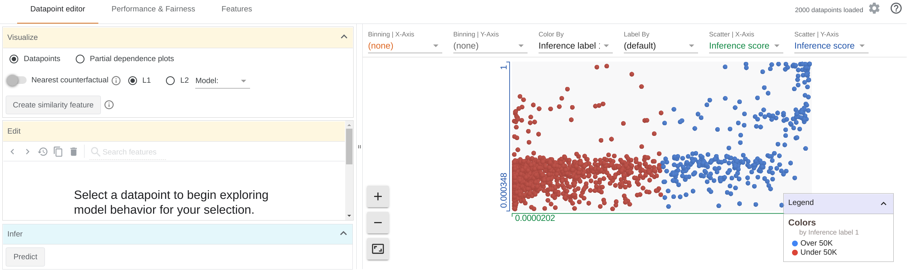

# CS 249r: Responsible AI

At the end of this assignment, you will learn how to identify bias in the outcome of a model and diagnose fairness concerns. We will do so by exploring the [UCI Census dataset](https://archive.ics.uci.edu/ml/datasets/census+income) via Google’s [What-If Tool](https://pair-code.github.io/what-if-tool/).

Credits: questions and instructions adapted from [this ML practicum by Google](https://developers.google.com/machine-learning/practica/fairness-indicators) and this [series of tutorials](https://pair-code.github.io/what-if-tool/learn/) on What-If.

## Learning Objectives

*    Explore the UCI Census dataset and compare the linear classifier and the DNN-based classifier’s predictions using the What-If Tool.
*    Identify potential sources of bias in the classifiers' predictions.
*    Explore how altering positive classification thresholds for different subgroups leads to differing outcomes.

## Optional Pre-reads

*    [Playing with AI Fairness](https://pair-code.github.io/what-if-tool/ai-fairness.html)
*    Jon M. Kleinberg, Sendhil Mullainathan, Manish Raghavan: Inherent Trade-Offs in the Fair Determination of Risk Scores. [https://arxiv.org/abs/1609.05807](https://pair-code.github.io/what-if-tool/ai-fairness.html)
*    Related [news article](https://www.propublica.org/article/bias-in-criminal-risk-scores-is-mathematically-inevitable-researchers-say) for the paper above.

## Assignment

The goal of this assignment is to learn how to identify and remove discrimination in ML systems. This assignment is *not* intended to teach you how to design neural networks for the given dataset, but rather to understand how unintended bias creeps in because of the nature of the dataset/model and ways of mitigating it.

The assignment is divided into **2** parts:

*    A primer on how classifiers can be unfair
*    Exploring the UCI Census dataset using the What-If Tool (WIT)

**Please submit a writeup with short answers to the <ins>questions</ins> that appear throughout the rest of this document. _Note: there are 10 questions in total and we do not expect you to turn in more than 1-2 pages of total writing._**

## A primer on how classifiers can be unfair

First, you will learn how discrimination manifests in classifiers, and how you might turn an unfair classifier into a fairer one.

Please walk through this [interactive article](https://research.google.com/bigpicture/attacking-discrimination-in-ml/) and answer the following questions related to the simulations in the article.

**<ins>Q1.</ins>** In the "Simulating loan thresholds" visualization:  
a.    What is the best threshold for maximizing the number of correct decisions?  
b.    What is the best threshold for maximizing profit?

**<ins>Q2.</ins>** In the "Simulating loan decisions for different groups" visualization, the equal opportunity loan strategy is shown to be the best tradeoff between profit and fairness for the given situation. Give one set of example distributions of the blue and the orange populations where the equal opportunity strategy would work poorly.

## Exploring the UCI Census dataset using the What-If Tool (WIT)

The previous part must have given you a glimpse of how complex fairness is, and the many different ways it can be defined. We will now use the WIT to visualize model behaviour for a large dataset, comparing a linear classifier and a DNN to predict whether a person earns more than $50K from their census information.

---

### Part 1: Exploring the data

*    Go to this Collab and step through all the cells: [https://colab.research.google.com/github/pair-code/what-if-tool/blob/master/WIT_Model_Comparison.ipynb](https://colab.research.google.com/github/pair-code/what-if-tool/blob/master/WIT_Model_Comparison.ipynb)
     *    _Note: We ran the cells with the preset default values, but if you find your machine is lagging excessively while running the WIT (it’s a browser-side tool), feel free to change `num_datapoints` in cell 8 to 500 or 1000. Please mention this in your writeup if you do so._

*    Click on the “Performance & Fairness” (PF) tab. You will see that the positive classification threshold is set as 0.5 by default for both models.
*    Set the ground truth feature dropdown in the PF tab to "Over-50K".
     *    **<ins>Q3.</ins>** Which one is more accurate, the linear classifier (model 1) or the DNN (model 2)?
*    Go back to the “Datapoint Editor” (DE) tab. Set “Scatter | X-Axis” to “Education | Num”. You will notice the models have learnt there is a positive correlation between education level and being high income.
*    Now set “Scatter | X-Axis” to “Inference Score 1” and “Scatter | Y-Axis” to “Inference Score 2”. Set “Color By” to “Inference Correct 1” or “Inference Correct 2”.
     *    Find a datapoint which is incorrectly classified by both models and click on it.
     *    This will open up the datapoint details in the Edit subwindow.
          *    **<ins>Q4.</ins>** Which feature(s) do you think is causing the datapoint to be misclassified?
     *    Flip the “Nearest counterfactual” toggle. The nearest counterfactual is the most similar datapoint that has a different inference result. Was your guess in Q4 right?
          *    **<ins>Q5.</ins>** Paste a screenshot of your current datapoint and its counterfactual in your writeup.
     *    You can now go ahead and edit the datapoint values one by one and check if the model’s prediction changes by clicking the “Predict” button, perhaps moving closer to the counterfactual.
     *    Partial dependence plots allow a principled approach to exploring how changes to a datapoint affect the model's prediction. Each partial dependence plot shows how the model's classification score changes as a single feature is adjusted in the datapoint. Feel free to click on the “Partial dependence plots” radio button and see how changes to each of the features affects the final classification.
          *    **<ins>Q6.</ins>** Paste a screenshot of the plot you see for the “Capital-gain” feature. What do you notice about this in comparison to the rest of the plots?

---

### Part 2: Fairness of the models

Now that you know how to analyze the data and model performance, let’s dive into finding potential sources of bias which could influence model performance in misleading ways.

*    Go to the “Features” tab. You can also sort by Non-uniformity. For key features such as sex and race, you would notice the data is skewed heavily.
*    Now go back to the PF tab and slice by sex.
     *    **<ins>Q7.</ins>** What do you observe about the accuracy of the model between men and women? Take a look at the confusion matrix. What do you notice? Do you think the heavily skewed data might be affecting this?
     *    **<ins>Q8.</ins>** As you learned in the previous section, there are many different ways of measuring fairness. Apply the different optimization strategies on the left (namely demographic parity, equal opportunity, and equal accuracy) and report your observations in terms of what they mean semantically. (hint: [this link](https://pair-code.github.io/what-if-tool/ai-fairness.html) might be helpful)
          1.    Calculate the true positive rates from the confusion matrices (defined [here](https://en.wikipedia.org/wiki/Sensitivity_and_specificity)) for demographic parity for models 1 and 2. 
          2.    Calculate the true positive rates for equal opportunity for models 1 and 2. 
          3.    From parts a. and b. (demographic parity vs equal opportunity), what differences do you notice for the threshold values, false positives (FPs), and false negatives (FNs) across men and women? Do you think one model is more unfair than the other?
          4.    Now optimize for equal accuracy -- take a closer look at the distribution of _inaccurate_ predictions for males vs females. What do you notice? Let’s say we choose to approve loans on the basis of positive predictions. How would this be problematic? Do you think we should try to avoid FPs more than FNs or vice-versa? Why? In which situations do you think one would be more costly than the other?
*    Somewhat unrelated to our dataset here but important nonetheless, is the “Cost Ratio” on the left. For the thresholding optimizations above, we have been assuming false positives (FPs) are as undesirable as false negatives (FNs). However in certain cases, FPs may be more costly than FNs, or vice versa; this setting allows you to weigh them accordingly by setting the cost ratio between FPs and FNs. (more information [here](https://pair-code.github.io/what-if-tool/learn/tutorials/cost-ratio/))
     *    **<ins>Q9.</ins>** Going back to our primer: in the “Simulating loan thresholds” visualization, given that a successful loan results in a profit to the bank of $300 but a default costs the bank $700, what should be the cost ratio between false positives and false negatives?
     *    **<ins>Q10.</ins>** For our current example, try out different Cost Ratio values to reduce the number of FPs and/or FNs (depending on your answer to Q8d.), optimizing for equal accuracy. What do you observe in the FP, FN, and accuracy percentages as you play around with the Cost Ratio knob?
