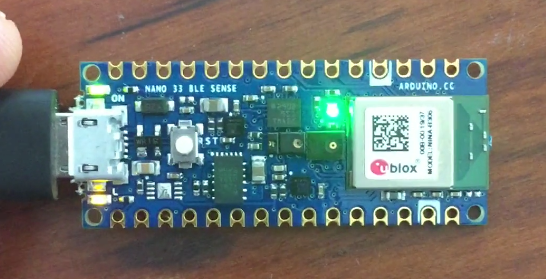
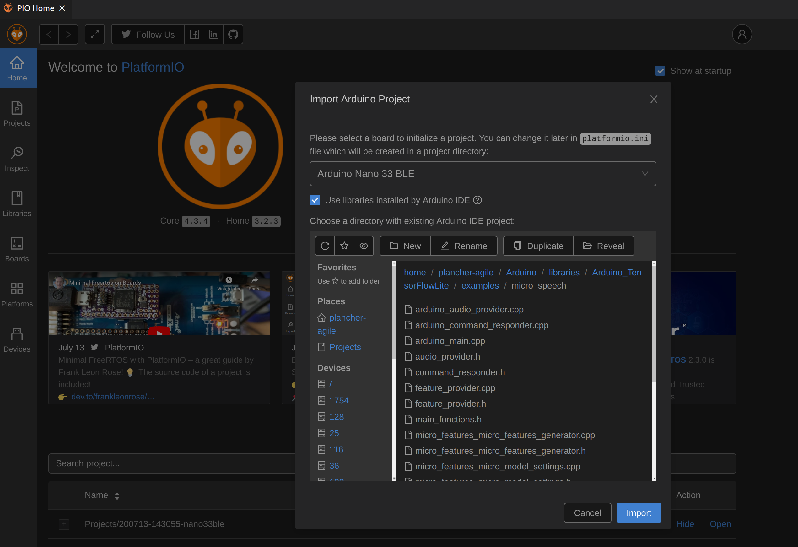
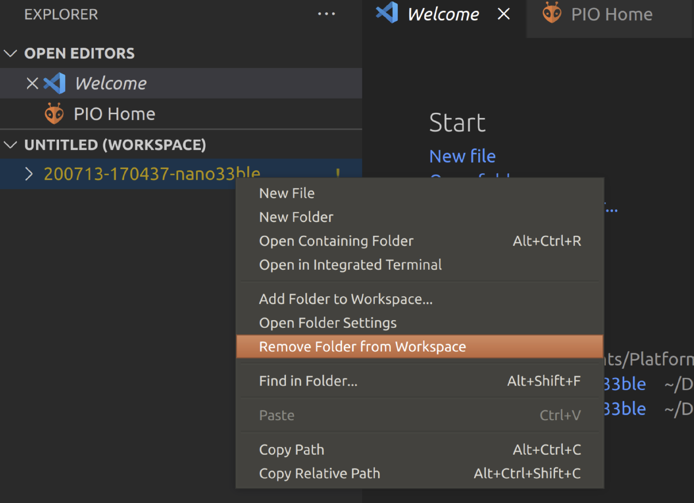
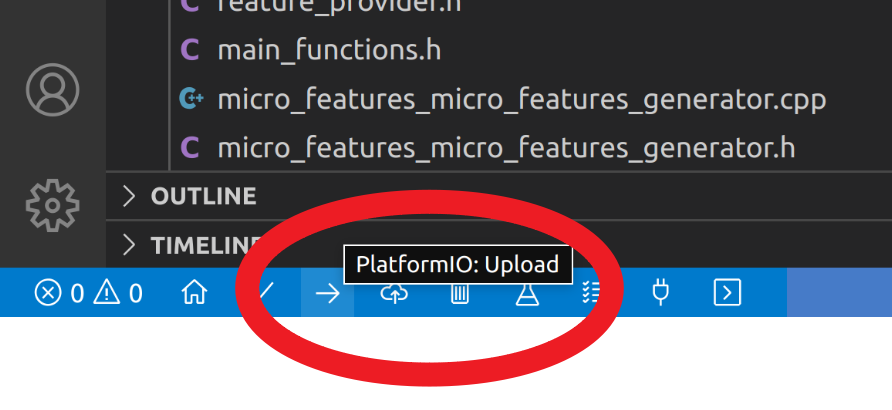
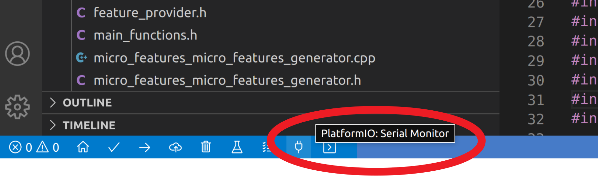
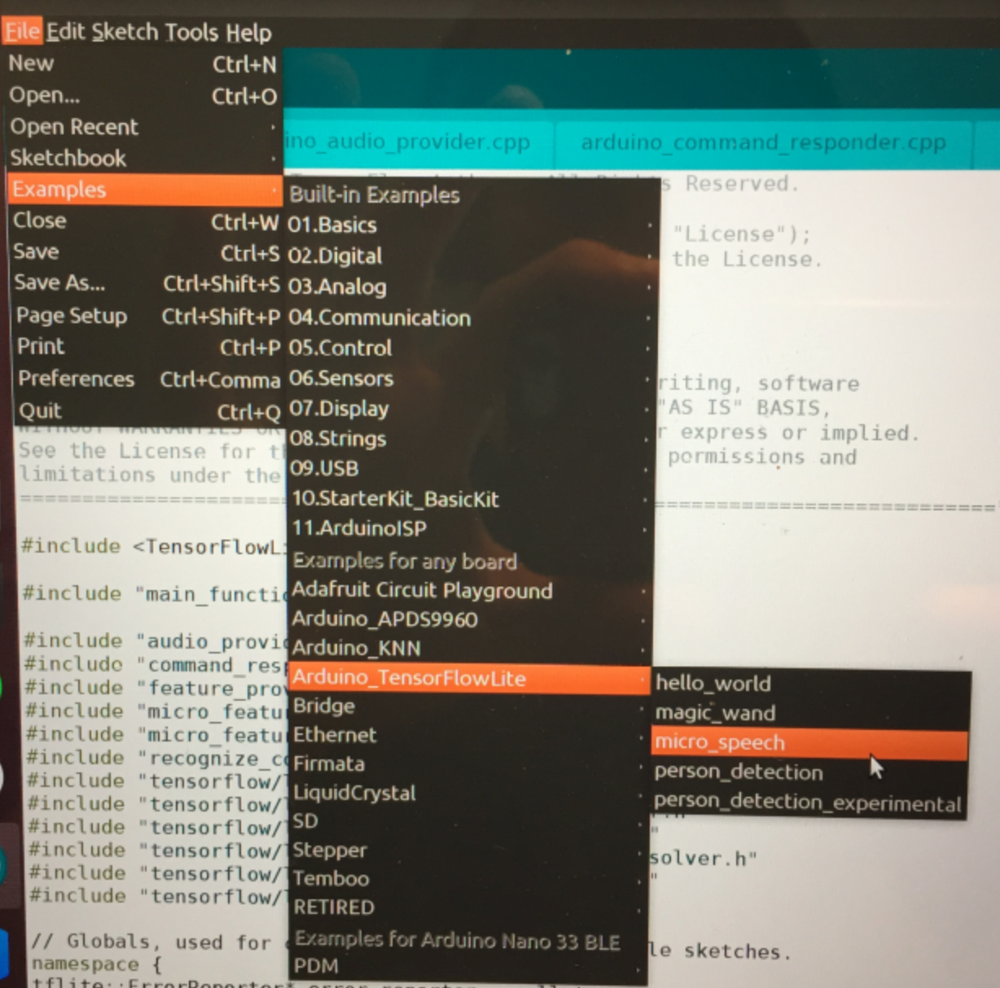
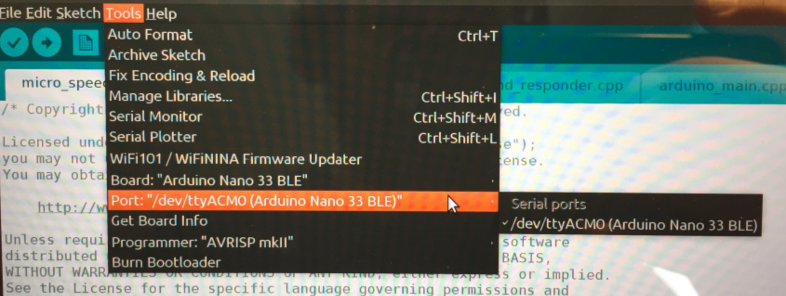
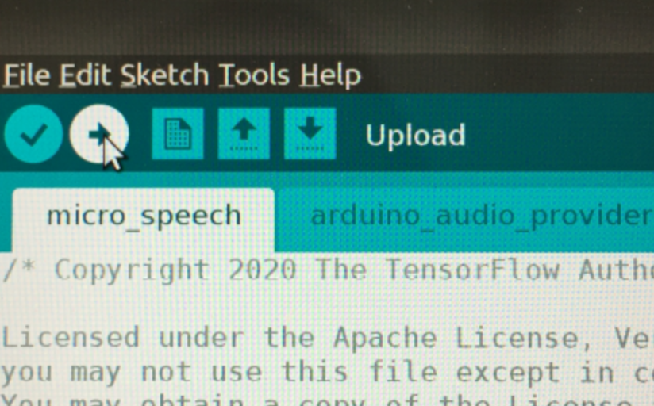
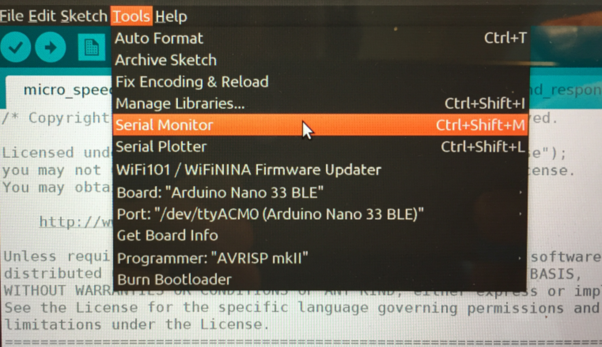

# CS 249r: Wake Words

At the end of this assignment you should have designed a data collection and testing scheme and collected your own speech dataset and used it to train a model to differentiate between 2-4 different words of your choice in your particular environment/setting.

Below is a simple example of one that trained by the course staff. It knows the wake words:
```
Brian: Turns on the Green LED
Annie: Turns on the Red LED
Alvin: Turns on the Blue LED
```
And is able to differentiate those words from many adversarial examples (e.g., Lying, Ryan, Buddy, Alec, Ervin, Marvin, Whammy)!



## Learning Objectives

* Get experience designing data collection and testing schemes for applications
* Get experience with the full learning flow (collect, process, train, evaluate, deploy) on embedded devices
* Get experience collecting data (recording voice input) and testing in the real world (using the device to recognize wake words)

Remember, as written up in the EETimes, [good data](https://www.eetimes.com/ai-sound-recognition-on-a-cortex-m0-data-is-king/#) is key to any successful real-world ML deployment!

## Relevant Chapters

* Chapters 7 & 8

We strongly suggest you read these chapters in their entirety as there is a lot more information included in there that will help you debug and develop your assignment. This document serves as a bare-bones set of step by step descriptions (with updated links as some have changed since the book's publication) to help you get through the assignment. 

**Finally, please read the assignment all the way through before starting!**

## Prerequisite(s) 
* Hello World assignment

## Assignment 

The goal of the assignment is not simply to collect the data and make the model work but to be thoughtful about how you collect your data, how you tested your model, and how you improved your scheme. To that end we want you to document the reasons why you made the choices you made. As we learned in our guest lecture, the requirements for different applications (and thus the data that needs to be collected) can vary drastically even for the same wake words!

Things to consider when designing your data collection and testing scheme include (but are not limited too):
* Who are the anticipated end users?
  * What will the age range be?
  * What languages will the user be speaking? Will the users have accents?
* What are the goals for using the application? How will this impact the requirements / needs of the ML model's performance?
  * Will the user be trying to turn specific lights on/off vs. turn the thermostat up/down vs. arm/disarm a security system vs play your favorite playlist from a smart speaker, etc.? 
  * What false positive or false negative rates can the application handle / what would the consequences be of such an event?
* In what environments will the users employ the application?
  * How much background noise do we expect? 
  * How far will the users be from the device, from noise sources in the environment? 
  * Will these values vary over time?
* In what situations will the users use the application? Will the users speech sentiments vary?
  * Will the user be stressed vs. calm vs. panicked?
  * Will the user use different volumes of voice (whispered/normal/loud/shouted)?
  * Will different users have different sentiments?
* How do all of these previously mentioned factors affect how much and what kinds of target, non-target, and imposter/adversarial data you will need to train with?
  * How likely is it that these wake words will be triggered unintentionally during conversation?
  * Who/how many people will be talking in the application environment?
* Given all of these previously mentioned factors what will you collect?
  * What custom wake words will you select? 
  * What background noise samples do you need to collect? 
  * What other words do you need to collect to ensure the model learns the difference between them and your wake words? As mentioned in the TinyML book, it is important to collect other words so that the model can learn your particular word and not simply the general sounds of humans talking!
  * How much data will you need to collect? We all know more is better (usually), but you also live in the real world with time constraints so how much do you think will be enough?
  * In what environments will you collect these samples?
* How will you test your model?
  * What words will you try? How many times will you try these words? Will any of them be adversarial? Remember even [current production systems](https://arstechnica.com/information-technology/2020/07/uncovered-1000-phrases-that-incorrectly-trigger-alexa-siri-and-google-assistant/) struggle with close words at times!
  * Who will test the model? How diverse will the testers be?
  * Will the testers vary their speech sentiments?
  * Where will the testers be in relation to the device?
  * In what environments will the testing happen?
* Finally, based on your initial testing, how will you improve your results:
  * What didn't work the first time? 
  * Will you need more or different data? 
  * How will you iteratively improve your results?

**Note: The training script takes between 1 and 2 hours to run on Google Colab (more instructions below). You will need to run training at least 3 times so make sure to start the assignment early enough that there is time for that to happen in the background while you do other things!**

## Submission Details

1. Submit a short write-up of you data collection and testing scheme answering many of the above questions. 
    + We DO NOT anticipate you will address all of them but do want you to try to address many of them (e.g., use 3 different sentiments tested from 5 different distances in 3 locations). **At a minimum we'd like you to discuss 4 types of variety you embedded into your scheme.**
    + Also include how you went about trying to collect the appropriate data and how successful (or not) you were in collecting the dataset. Did you need to collect more data or update your scheme? What did you do to make it better? Include anything you learned from this experience. **At a minimum we'd like to see 2 runs of training on your custom data with insights/improvements made based on the output of the initial results.**
2. Submit a short write-up your final results. Was your model able to work in your environments / for your application? Why or why not? Do you have any ideas for how to improve it if you had more time/resources? Where did it fall short?
3. Submit a short video showing your model in action. Where possible include any interesting videos coming out of your testing process as well. Can you prove that it can handle tough and relevant examples?
4. Submit the final ```model.cc``` trained model file along with the wake words used in the final model so we can run it ourselves. We're excited to see what you come up with!

## How to do this assignment efficiently
As mentioned in the assignment introduction by the end of this assignment you will have completed the full learning flow: collect, process, train, evaluate, deploy. In order to help you effciently complete this we have 1) included code that does many of these steps for you, 2) included instructions below that walk you through how to use the code. **Note that you can move onto designing your data collection and testing scheme and doing your initial data collection while you train the base model (which again will take 1-2 hours)!** And later on your can work on your final writeup while you are doing more training!

## Deploying a speech model to the Microcontroller Using VSCode + PlatformIO
Here we document how to deploy the pre-trained model to your microcontroller to make sure your hardware setup is working.

1. Import the project. Note: the default location of the ```Arduino``` folder varies by operating system but it often ends up in either the home folder or Documents folder. For the rest of this document we will refer to that folder as ```ARDUINO_HOME```. Inside of PlatformIO open the project: ```ARDUINO_HOME\libraries\Arduino_TensorFlowLite\examples\micro_speech ```. Make sure to select the ```Arduino Nano 33 BLE``` board (just like in the Hello World Assignment) and check the box to ```Use libraries installed by Arduino IDE```.
  You can safely ignore the warning:
  ```
  C/C++ IntelliSense service does not support .INO files. It might lead 
  to the spurious problems with code completion, linting, and debugging. 
  Please convert .INO sketch into the valid .CPP file.
  ```


2. If you would like to rename your PlatformIO project from the default name, first close VSCode.  Again we note that the default location of the ```PlatformIO``` folder varies by operating system but it often ends up in either the home folder or Documents folder. For the rest of the document we will refer to that folder as ```PLATFORMIO_HOME```. Your newly imported project folder will be located at ```PLATFORMO_HOME/projects``` and will be named as the date and time you imported it followed by the board name (e.g., ```200713-170437-nano33ble```). Rename the project folder using your OS's file explorer to whatever name you would like. Then reopen VSCode. You will notice that in your workspace (on the left of the UI) the old project folder name will be highlighted in yellow. Right click it and select ```Remove Folder from Workspace```. Finally, re-add the renamed workspace by using the dropdown menus ```File -> Add Folder to Workspace``` and select the renamed folder.


3. Connect the board. PlatformIO will autodetect it and the correct port.

4. Upload the sketch to the device by clicking the PlatformIO upload button which looks like a right facing arrow in the PlatformIO ribbon in the bottom left of the VSCode Window. **You must have the micro_speech.ino file selected in the editor when you click upload or the IDE won't know to use that as the main function and the compilation will fail!** It is normal to see lots of warnings when you compile the code (welcome to working with bleeding edge code). If you are getting compilation errors like ```fatal error: tensorflow/lite/c/common.h: No such file or directory``` make sure to check your ```platformio.ini``` file. It likely has the wrong value for the Arduino library path ```YOUR_ARDUINO_FOLDER_PATH``` in the line:  ```lib_extra_dirs = YOUR_ARDUINO_FOLDER_PATH/libraries```.  If that line is not already in your ```platformio.ini``` then you forgot to check the box in step 1 &mdash; simply add it now.


5. Now open the serial monitor with the PlatformIO serial monitor button that looks like an electrical plug.


6. Test that the device is working. You should be able to see the output on the serial monitor / LEDs for the following words (Note that it will make some mistake. Speaking slower, repeating the word multiple times, and over-enunciating will help.):
```
Yes     = Turns on the Green LED
No      = Turns on the RED LED
Unknown = Turns on the Blue LED
Silence = Nothing
```
Note for Ubuntu/Linux users: If you are able to open the serial monitor and connect to the board and the light on the board is blinking but it doesn't respond to any of your commands &mdash; you may have a bad microphone library in your platformIO install. This can be solved by copying over the library from your Arduino install. If you would like to confirm that this is your problem follow the Arduino IDE instructions below and see if that works. If it does then this is definitely your problem. On my Ubuntu 18.04 machine the board specific libraries for Arduino were located at  ```~/.arduino15/packages/arduino/hardware/mbed/1.1.4/libraries``` and in PlaltformIO were located at ```~/.platformio/packages/framework-arduino-nrf52-mbedos/libraries```. The microphone library is the folder called ```PDM``` simply rename the existing folder in the PlatformIO folder PDM_old and then copy over the Arduino folder as PDM and then everything should work! If those folders (or something similar) don't exist for you, in the Arduino IDE you can open the PDM example ```File -> Examples -> Nano 33 BLE -> PDM -> PDMSerialPlotter``` and then go to ```Sketch -> Show Sketch Folder``` and that should get you to a subfolder inside that PDM folder we are looking for. On PlatformIO simply add to one of the cpp files in your project ```#include <PDM.h>``` then right cick that line and select ```Go to Definition``` this will open the file ```PDM.h``` then right click that file and select ```Open Containing Folder``` and you will again be inside a subfolder of the PDM folder we are looking for.

**If you are having a lot of trouble with this please contact the course staff. Also please try the Arduino IDE flow at the end of this document before contacting the course staff to help us diagnose the problem.**

## Training a model
Now lets try to train the model to learn different words. For this we are going to use the Google Colab found on this [GitRepo](https://github.com/tensorflow/tensorflow/blob/master/tensorflow/lite/micro/examples/micro_speech/train/train_micro_speech_model.ipynb). Note that the file changed from what is written in the book! Simply click the ```Run in Google Colab``` link and note that the link to click for Colab will still appear in Colab so check the URL and don't keep infinitely clicking!


1. First make sure you are set to use the GPU for training (this will save HOURS!). Note: in many cases this is enabled by default but it's always worth checking! Click through the drop-down menus:
``` Runtime -> Change runtime type -> Hardware Accelerator = GPU ```

2. In the first code block select your wake words. For this part of the assignment we are going to use a [dataset precollected by Pete](https://arxiv.org/pdf/1804.03209.pdf) so that we can focus on the training of the model to make sure that is working. It contains [O(1000) examples](https://storage.googleapis.com/download.tensorflow.org/data/speech_commands_v0.02.tar.gz) of the numbers one to nine, a handful of robotics/IoT words, and some additional words that cover a lot of different [phonemes](https://en.wikipedia.org/wiki/Phoneme). We suggest picking 2-4 words from the list below and setting, as an example, ```WANTED_WORDS = "on,off"```. Do not place spaces between the words and the commas or it will break the script. Note that while the last line of words was chosen to cover addiitonal background phonemes, the course staff got ```WANTED_WORDS = "cat,dog,house"``` to work well.
```
"one", "two", "three", "four", "five", "six", "seven", "eight", "nine",
"yes", "no", "up", "down", "left", "right", "on", "off", "stop", "go", 
“backward”, “forward”, “follow”, “learn”,
"bed", "bird", "cat", "dog", "happy", "house", "marvin", "sheila", "tree", "wow".
```

3. Then run that cell by either clicking the play button or hitting ```shift+enter``` while on the cell (```cmd+cntrl+enter``` on Mac). Note that while the cell is running the play button will turn into a spinning circle and when it is done it will turn into a number indicating when that cell ran (the Colab has global memory so it is important that constants used in later cells are defined/run earlier).

4. Then run the rest of the cells until you get to "Training." These cells load in training constants and paramenters, download and install tensorflow, ensure all directories are clear and ready for training, and launch the TensorBoard training monitor GUI.

5. Now run training which will take about 2 hours with the GPU mode on.
    + As it progresses you should see the training status show up in the Tensorboard area. If this works it is very helpful for analyzing your training progress. Unfortunately, the staff has found that it sometimes doesn't start showing data for a while (~15 minutes) and sometimes doesn't show data until training completes (and instead shows ```No dashboards are active for the current data set.```). If it is working and then stops updating look to the top of the cell and click ```reconnect```. If you happen to close the window see the TinyML book Ch 8 for ways to try to reconnect.
    + **Importantly, every hour or so you should make sure to remind colab you are still there by clicking around in a cell or clicking reconnect on the tensorboard cell (after 90 minutes of no activity it will kill the instance)!** But/and beyond that you can absolutely minimize the window and continue with other work.
    + If tensorboard is not updating you will initially see a bunch of text in the training cell and then you will just see the circle spin with the last line of text being something like: ```Successfully opened dynamic library libcudnn.so.7```. This is normal. After 1-2 hours it should complete and in almost all cases you will then get final training graphs showing up on tensorboard and the spinning circle will become a number.
    + With regards to the "skipping training" cell. This will ONLY work for ```WANTED_WORDS = "on,off"```, and we strongly suggest running training yourself to understand the process for when you use your own dataset.
    + **Remember while this is training you can move onto designing your data collection and testing scheme, collecting data, and writing up your final report!**
 
6. Once training is done run all of the remaining cells in the colab. These cells generate a model from your final training data, convert that model into a compressed and quantized model, test the model's accuracy, and finally generates a binary model file for use on your microcontroller.

7. To download the final binary model file to deploy to your microcontroller click the little folder icon on the left of the colab and download ```models/model.cc``` (note the name changed from what is writen in the book). Click the three dots to pick download. **DOWNLOAD IT NOW!** because after 12 hours of total life the Colab instance will be auto-killed. 
    + Also if you'd like to download the training data to use another time add a new code cell to the colab and run: ```!zip -r /content/train.zip /content/train``` and then refresh the files list. This will give you a zip folder of training checkpoints you can download! In general prepending any bash command with ```!``` will get it to run in Colab. If you need to upload that training data into a colab you can do that by pressing the upload button.


8. Moving back into VSCode+PlatformIO, you then need to prepare a project to deploy your new model to your microcontroller. We suggest you re-import the ``Micro_Speech`` code into a new project so that you can modify it and still retain the original working example code.
    + If you are using the Arduino IDE simply go to the folder that holds the example and copy the ``Micro_Speech`` folder and paste the copy somewhere else. One nice place to put things would be in a ```TinyML``` folder inside of your main Arduino folder.

9. The changes we need to make are:
    + ```micro_features_model.cpp``` replace the binary model data with the one your downloaded from Colab by copying and pasting both the binary data that encodes the model (0x00 etc.) and the final binary length which you can find at the end of the file. Note that the files aren't identical so be careful to just copy and paste those two things into the correct places.
    + ```micro_features_micro_model_settings.cpp``` replace the "yes", "no" lines with "on", "off" (or with the words you picked). Note: if you have more than two words you'll need to change the variable ```kCategoryCount``` in ```micro_features_micro_model_settings.h``` to the correct number of words plus 2 (for unknown and silence).
    + ```arduino_command_responder.cpp``` update the actions to respond to your words (and potentially add additional actions if you have more than 2 words). The block of code we are going to change is shown below. Here the ```found_command``` varaible is a string with the word of the command found (or silence or unknown). Therefore you can set it to turn on various LEDs if it finds various words by changing the ```if``` statements. For example, for ```on,off``` we could change the first if statement to: ```found_command[0] == 'o' && found_command[1] == 'n'```. Eventually you can come up with complex responses, but at first we suggest that you keep it simple to make sure the whole flow is working.
    ```
    // If we hear a command, light up the appropriate LED
    if (found_command[0] == 'y') {
      last_command_time = current_time;
      digitalWrite(LEDG, LOW);  // Green for yes
    }

    if (found_command[0] == 'n') {
      last_command_time = current_time;
      digitalWrite(LEDR, LOW);  // Red for no
    }

    if (found_command[0] == 'u') {
      last_command_time = current_time;
      digitalWrite(LEDB, LOW);  // Blue for unknown
    }
    ```

10. Upload it to your device and test it out! Again don't worry if it takes a minute or two to compile or you see compiler warnings!

11. If your serial port is working but you are getting a ton of printouts that say something like: ```Requested feature_data_ size 536907080 doesn't match 1960```, you have an outdate version of the Ardino TensorFlow Libarary. Make sure you upgrade to version 2.x (see Hello World for instructions)! **You'll then need to go back to step 5 to re-create your folder using the new code.**

## Developing your own dataset

We have [forked a version](https://github.com/tinyMLx/open-speech-recording/) of Pete's Open Speech Recording application to use only local memory which you can use to record your own datafiles. If you'd like a more robust version that you want to share with others to aid in your data collection (and therefore use a google storage buckets which may cost some money) please see [Pete's original project](https://github.com/petewarden/open-speech-recording). You can setup and use our version of the app as follows.

1. Clone the repository and install the only requirement, flask:
  ```
  git clone https://github.com/tinyMLx/open-speech-recording.git --branch v1.0
  cd open-speech-recording
  git submodule update --init --recursive
  pip install flask
  ```

2. To update the words you are recording and how many recordings of each word you are collecting, change the counts and values at the top of the app file in the open-speech-recording repository: ```open-speech-recording/static/scripts/app.js``` (you can edit this file by opening it in VSCode). The default is 5 copies of each wake word (in this case just "hello") and 1 copy of each other/unknown/filler word (in this case just "world"). Hint: you will want to record **MANY** more than that (of course we do not expect you will have time to collect O(1000) examples per category like Pete's dataset)! You can then run the server locally (from within the open-speech-recording folder) by running:
  ```
  export FLASK_APP=main.py
  python -m flask run
  ```

3. Then open the link provided in the terminal in a web browser to run the application. Make sure to **run the application in a private or incognito window** which avoids any cacheing issues. Also we've found that the app works best when **using Chrome** so if you are having issues with another browser please try it in Chrome. Once the app opens you'll need to give access to your microphone, and then you can click ```Record```. Once you finish recording all of the words a popup will appear and ask if you'd like to download the data. Simply click ```OK``` and the files will be downloaded into the folder from which you are running the flask app (which should be the open-speech-recording folder). You can then close the browser window.

3. Once you are done recording via the application kill it with ```cntrl+c``` you will find that you now have a large collection of ```.ogg``` files in your directory. We now need to convert them to ```.wav``` files using ```ffmpeg```:
  ```
  sudo apt-get install ffmpeg
  mkdir wavs
  find *.ogg -print0 | xargs -0 basename -s .ogg | xargs -I {} ffmpeg -i {}.ogg -ar 16000 wavs/{}.wav
  ```

4. Then we need to trim them using Pete's tool. Note: background noise does not need to be trimmed and does not need to be recorded by the tool &mdash; you simply need to convert them to ```.wav``` files. In fact, they are expected to be longer. See the [original dataset](https://storage.googleapis.com/download.tensorflow.org/data/speech_commands_v0.02.tar.gz) for examples. 
  ```
  mkdir trimmed_wavs
  make -C extract_loudest_section/
  /tmp/extract_loudest_section/gen/bin/extract_loudest_section 'wavs/*.wav' trimmed_wavs/
  ```
5. Finally we need to create the directory structure as the training script expects that the data is organized into folders where there is one folder for each of the ```wanted_words``` filled with ```.wav``` files of the wanted words (as 1 second clips) and an additional folder called ```_background_noise_``` containing longer files of background noise. We will then compress this into a zip file so it can be easily uploaded to Colab. 
  ```
  python organize_wavs.py
  cd output_wavs
  zip -r my_dataset.zip *
  ```

6. A good cell to add to the colab to unzip, download, and untar your data and the default data into the ```dataset``` directory which the colab expects it is shown below. Of course you don't need to use the default data, however using that at least for some background / unknown data may save you a lot of time as there are O(1000) samples for each category!
```
!wget "https://storage.googleapis.com/download.tensorflow.org/data/speech_commands_v0.02.tar.gz"
!unzip my_dataset.zip -d dataset
!tar -xvf speech_commands_v0.02.tar.gz -C dataset
```

## Training with your own data

We are going to do training back in the same Colab which again can be found via this [GitRepo](https://github.com/tensorflow/tensorflow/blob/master/tensorflow/lite/micro/examples/micro_speech/train/train_micro_speech_model.ipynb). 

1. The [training script](https://github.com/tensorflow/tensorflow/blob/master/tensorflow/examples/speech_commands/train.py) which is used in the colab can be modified to use your own dataset by simply adding the line ``--data_url=''`` which will prevent the script from downloading and using the default dataset. The final command is shown below. Most of the constants can be safely modified and are set in the first two cells of the Colab. Some ones of particular interest are ```UNKNOWN_PERCENTAGE``` and ```SILENT_PERCENTAGE``` which specify the percentage of training that should be done with either silence or unknown words. Note: silence is taken from the background noise, and unknown is sampled from any non-wake words included in the dataset. Something in the 15-30 range for each might be a good first guess.
```
!python tensorflow/tensorflow/examples/speech_commands/train.py \
        --data_dir={DATASET_DIR} \
        --data_url='' \
        --wanted_words={WANTED_WORDS} \
        --silence_percentage={SILENT_PERCENTAGE} \
        --unknown_percentage={UNKNOWN_PERCENTAGE} \
        --preprocess={PREPROCESS} \
        --window_stride={WINDOW_STRIDE} \
        --model_architecture={MODEL_ARCHITECTURE} \
        --how_many_training_steps={TRAINING_STEPS} \
        --learning_rate={LEARNING_RATE} \
        --train_dir={TRAIN_DIR} \
        --summaries_dir={LOGS_DIR} \
        --verbosity={VERBOSITY} \
        --eval_step_interval={EVAL_STEP_INTERVAL} \
        --save_step_interval={SAVE_STEP_INTERVAL}
```

2. When running the colab with your data make sure to change the training line as mentioned above and also change the ```DATA_URL``` variable in the ```Generate a TensorFlow Lite Model``` section to ```''``` as well! 

3. We also suggest adding a ```print(i)``` into the loop of the function ```representative_dataset_gen()``` in the ```Generate a TensorFlow Lite Model``` section. This is because if you dataset is small you will find that it will error out on that function call with an error that looks something like ```ValueError: cannot reshape array of size 0 into shape (1,1960)```. All you need to do then is change the loop from ```for i in range(100):``` to ```for i in range(TBD):``` where TBD is one less than the largest value of ```i``` that gets printed and then it should work.

4. Now deploy the model to your microcontroller and see how it worked!

## Lingering Questions & Suggestions
In the spirit of constant improvement, please let us know how this lab might be improved in the future! What was confusing? What didn't work? What could be better explained?

## Deploying a speech model to the Microcontroller Using the Arduino IDE (in case you are having trouble with VSCode + PlatformIO)
The instructions remain the same at a high level, however the flow through the IDE is a little different.
1. Open the default micro-speech example. You can find it in the drop down menus by following:
``` File -> Examples -> Arduino_TensorFlowLite -> micro_speech ```


2. Connect the board and make sure you have the correct board and port selected (unlike with VSCode+PlatformIO you must specify the port each time and make sure the correct board is selected):
``` Tools -> Board -> Arduino Nano 33 BLE ```
``` Tools -> Port -> XXXXX (Nano 33 BLE) ``` where XXXXX is some port on your computer (The exact port will differ depending on your OS and what else is using ports on your computer. Usuaully it will be something along the lines of ```COM0``` (Windows), ```/dev/usbmodem0``` (Mac OSX), or ```ttyACM0``` (Ubuntu 18.04).


3. Upload the sketch to the device by clicking the ``` Upload ``` button in the top left of the IDE. Again, it is normal to see lots of warnings when you compile the code.


4. Open the serial monitor with: ``` Tools -> Serial Monitor ```.


5. Test that the device is working. You should be able to see the output on the serial monitor / LEDs for the following words (Note that it will make some mistake. Speaking slower, repeating the word multiple times, and over-enunciating will help.):
```
Yes     = Turns on the Green LED
No      = Turns on the RED LED
Unknown = Turns on the Blue LED
Silence = Nothing
```
**If you are still having problems at this point please contact the course staff ASAP so we can help you debug!**
